# Documentation

My documentation

** NOTE: This repo is GitFlow enabled **

## How to start creating content

1. Download the repo
2. Make sure you have **nodeJs** installed [Instructions](https://nodejs.org/en/download)
3. Go to the project root folder
4. Run `npm i` to install dependencies
5. Run `npm run docs:dev` to preview in realtime the final site
6. Edit the content
7. Commit your changes as usual and let the automation publish the changes.

## Mermaid colors

```mermaid

flowchart TD

    classDef primary fill:#48caff
    classDef secondary fill:#29a979
    classDef accent fill:#fbcb1f
    classDef neutral fill:#0b0517
    classDef base100 fill:#fcfcfc
    classDef info fill:#00e0ff
    classDef success fill:#00d181
    classDef warning fill:#d18100
    classDef error fill:#d10000

    primary:::primary
    secondary:::secondary
    accent:::accent
    neutral:::neutral
    base100:::base100
    info:::info
    success:::success
    warning:::warning
    error:::error

```

