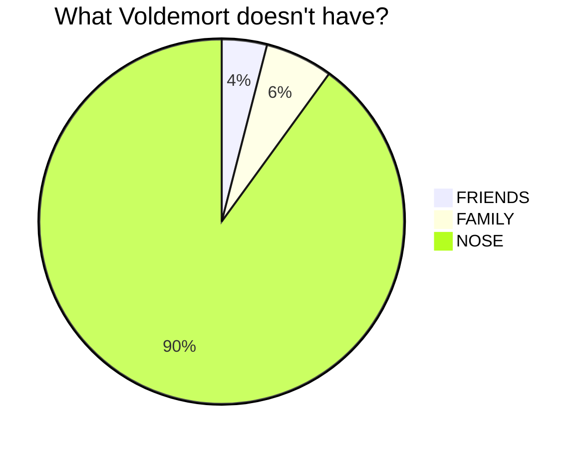
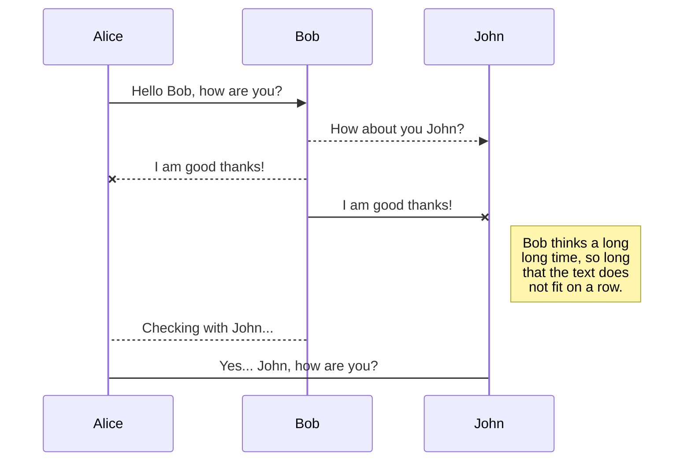
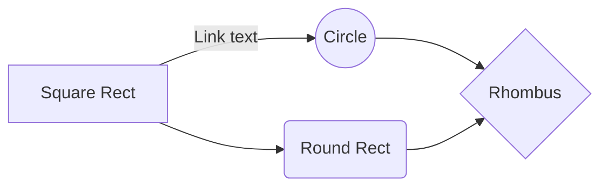
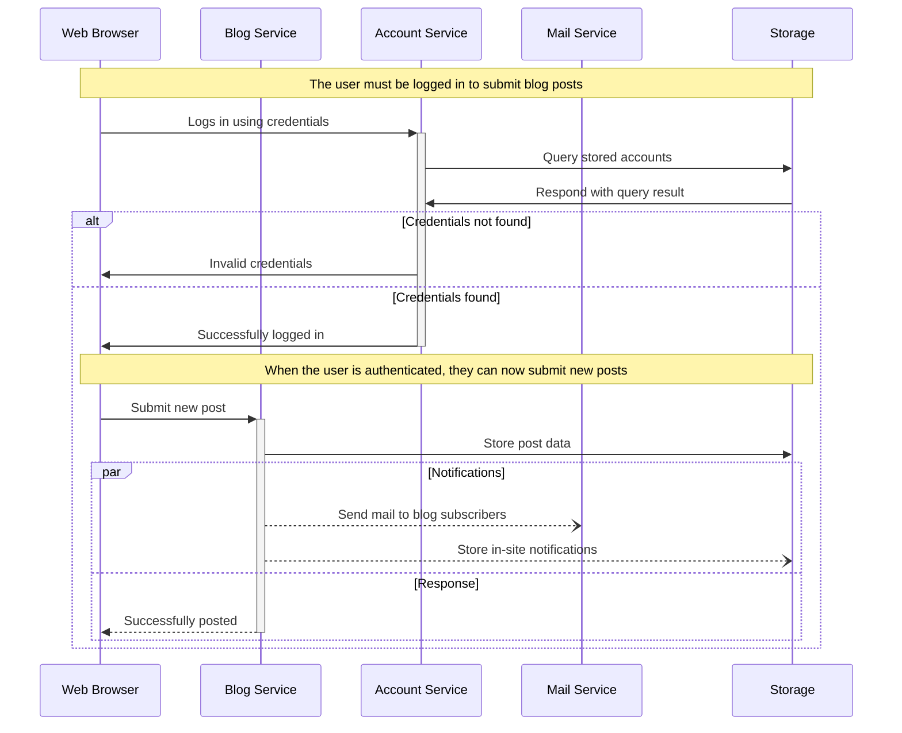
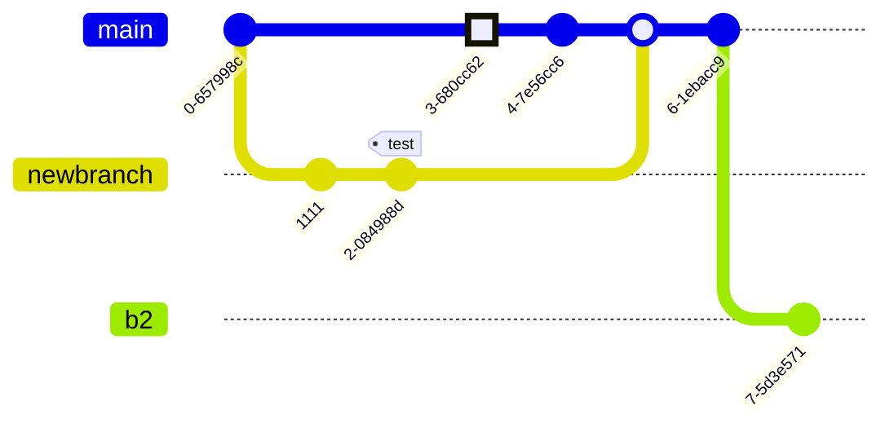
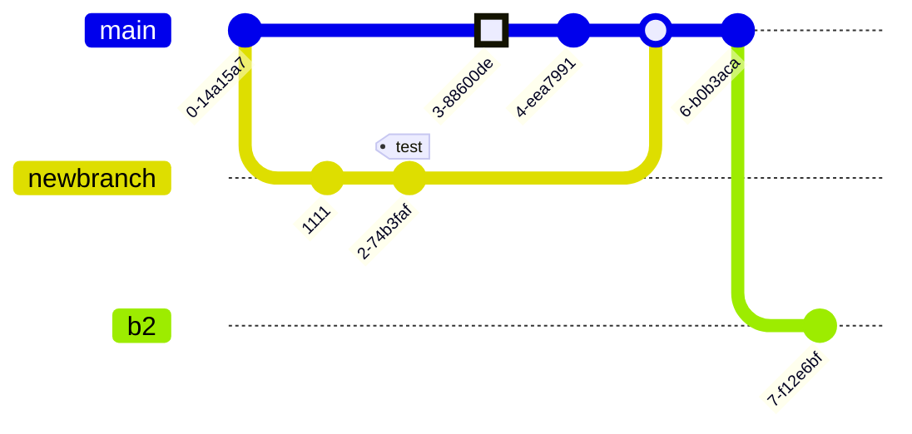

# Mermaid 

This page contains a collection of examples of diagrams and charts that can be created through Mermaid.

## Basic Pie Chart

````

````


## Basic sequence diagram

````

````


## Basic flowchart

````

````


## Sequence Diagram: Blogging app service communication

````

````


## A commit flow diagram.

````

````



## More

Check out the documentation for the [full list of Mermaid features] (https://mermaid.js.org/)
