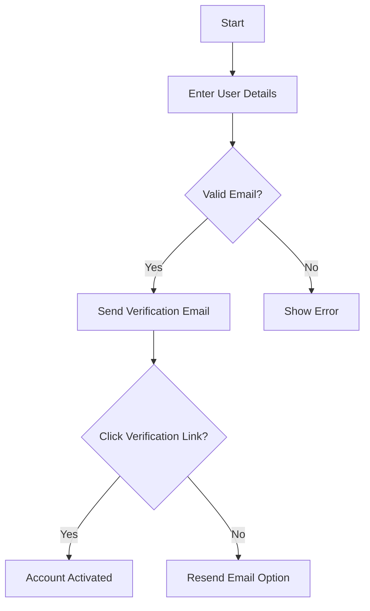
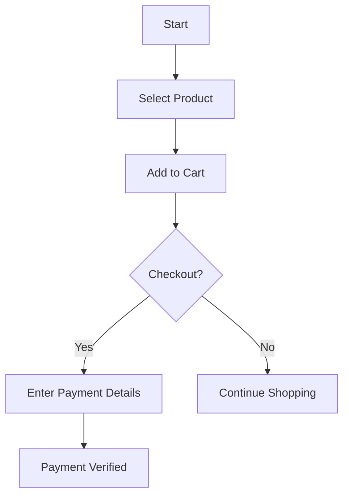
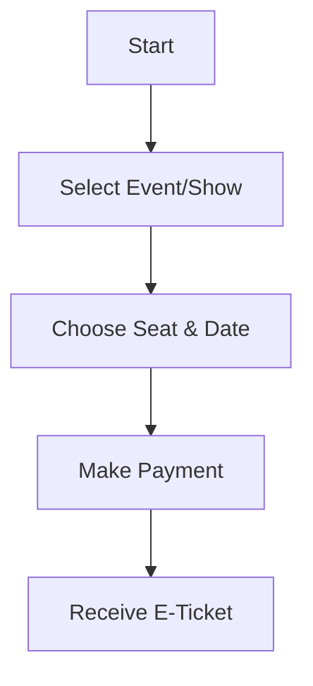
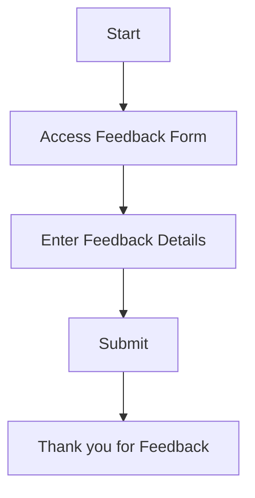
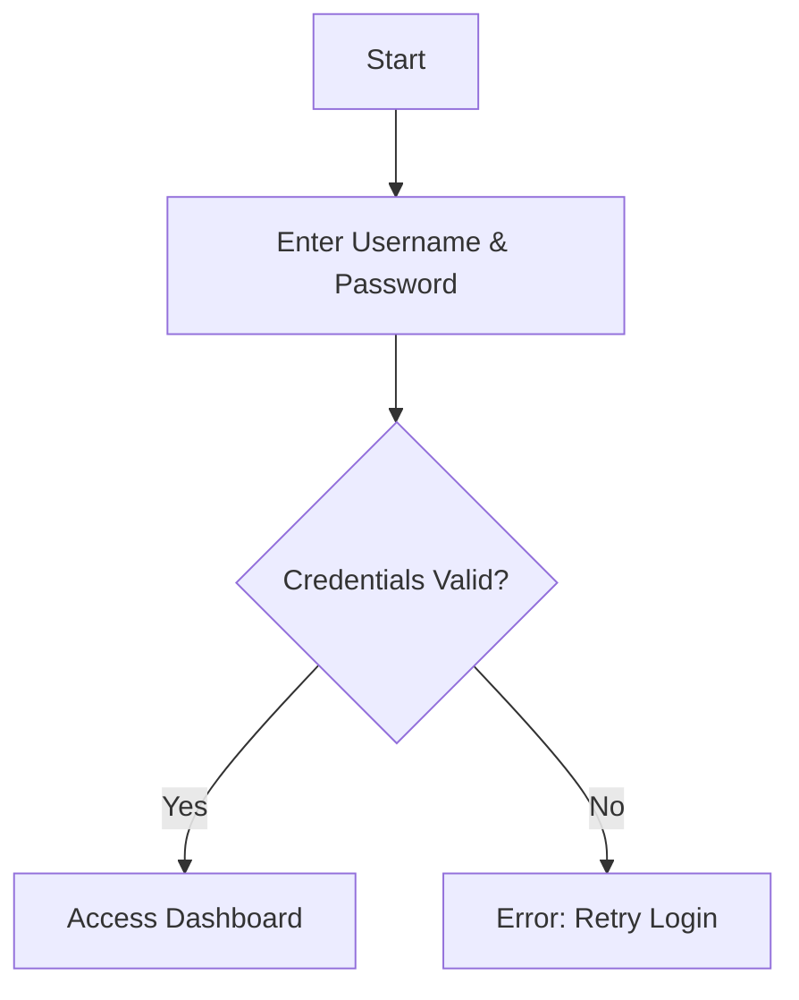

# Market flash ETL document

::: danger NOTE!!! :exclamation:
This document is just to exemplify a customized documentation that uses the dynamically generated RecordSchemas that will be always updated as the code evolves, while living inside a customized document.
:::

## User Registration Process

Our system follows a streamlined approach for user registrations. The registration process consists of a series of steps that ensure security and simplicity for all users.

### Registration Flow

The following flowchart describes the user registration process:

<!--@include: ./_dynamicRecordDefinitions/ActividadesAcciones.md-->

## Product Purchase Flow

<!--@include: ./_dynamicRecordDefinitions/ActividadesAgente.md-->

## Ticket Booking Process

<!--@include: ./_dynamicRecordDefinitions/ActividadesCuestionariosData.md-->

## Feedback Submission Flow

<!--@include: ./_dynamicRecordDefinitions/ActividadesData.md-->

## User Login Process

<!--@include: ./_dynamicRecordDefinitions/ActividadesGestores.md-->
