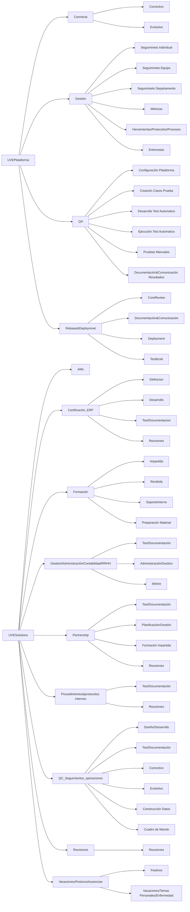

# Reporta

```mermaid

flowchart LR

    UVEPlataforma --> Connecta

    Connecta --> Correctivo
    Connecta --> Evolutivo

    UVEPlataforma --> Gestión

    Gestión --> GS1["Seguimineto Individual"]
    Gestión --> GS2["Seguimineto Equipo"]
    Gestión --> GS3["Seguimineto Departamento"]
    Gestión --> Metricas
    Gestión --> Herramientas/Protocolos/Procesos
    Gestión --> Entrevistas

    UVEPlataforma --> QA

    QA --> QA1["Configuración Plataforma"]
    QA --> QA2["Creación Casos Prueba"]
    QA --> QA3["Desarrollo Test Automatico"]
    QA --> QA4["Ejecución Test Automatico"]
    QA --> QA5["Pruebas Manuales"]
    QA --> QA6["Documentación&Comunicación Resultados"]

    UVEPlataforma --> Release&Deploymnet

    Release&Deploymnet --> CoreReview
    Release&Deploymnet --> RD2["Documentación&Comunicación"]
    Release&Deploymnet --> Deployment
    Release&Deploymnet --> RD4["Test&Uat"]


    UVESolutions --> AMs
    UVESolutions --> Certificación_ERP

    Certificación_ERP --> Definicion
    Certificación_ERP --> Desarrollo
    Certificación_ERP --> TSTERP["Test/Documentacion"]
    Certificación_ERP --> ERPRE["Reuniones"]

    UVESolutions --> Formación

    Formación --> Impartida
    Formación --> Recibida
    Formación --> SoporteInterno
    Formación --> FO4["Preparación Material"]

    UVESolutions --> Gestion/Administración/Contabilidad/RRHH

    Gestion/Administración/Contabilidad/RRHH --> TSTGST["Test/Documentación"]
    Gestion/Administración/Contabilidad/RRHH --> Administración/Gestion
    Gestion/Administración/Contabilidad/RRHH --> RRHH

    UVESolutions --> Pertnership

    Pertnership --> PRT1["Test/Documentación"]
    Pertnership --> Planificación/Gestión
    Pertnership --> PRT3["Formación Impartida"]
    Pertnership --> P_Reuniones["Reuniones"]

    UVESolutions --> PPI["Procedimientos&protocolos internos"]

    PPI --> PPI1["Test/Documentación"]
    PPI --> PPI2[Reuniones]

    UVESolutions --> QC_Seguimientos_operaciones

    QC_Seguimientos_operaciones --> Diseño/Desarrollo
    QC_Seguimientos_operaciones --> TSTQC["Test/Documentación"]
    QC_Seguimientos_operaciones --> CorrectivoOPS["Correctivo"]
    QC_Seguimientos_operaciones --> EvolutivoOPS["Evolutivo"]
    QC_Seguimientos_operaciones --> QC5["Construcción Datos"]
    QC_Seguimientos_operaciones --> QC6["Cuadro de Mando"]

    UVESolutions --> Reuniones

    Reuniones --> 2_Reuniones["Reuniones"]

    UVESolutions --> Vacaciones/Festivos/Ausencias

    Vacaciones/Festivos/Ausencias --> Festivos
    Vacaciones/Festivos/Ausencias --> VAC["Vacaciones/Temas Personales/Enfermedad"]


```
