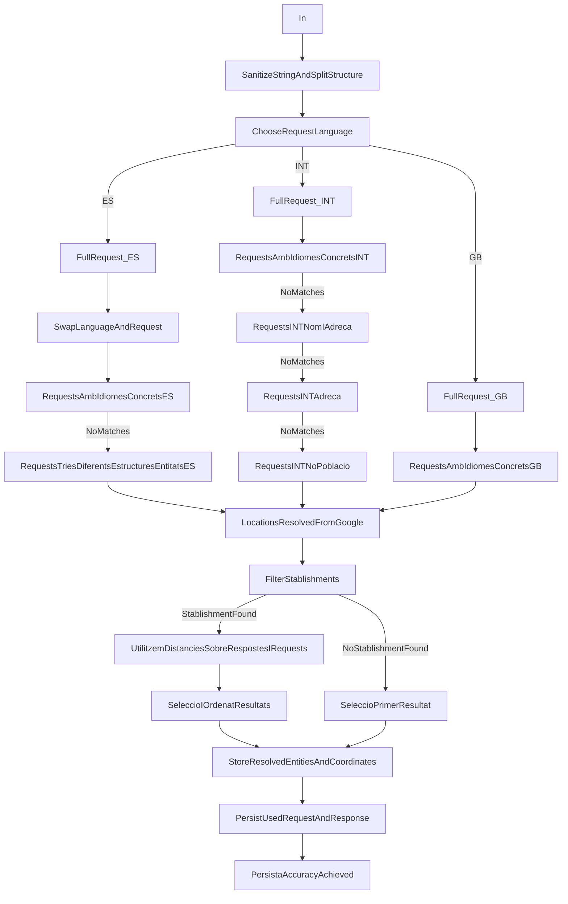

# Matching

## TODO

- Have a clear overview of the current process: **Oriols!!**
- Clearly define '**Normalization**', '**GeoCoding**', '**Reverse GeoCoding**', '**Matching**'

## Concepts

Normalization: 

## Current Flow

- SanejatString + Split: 
    - ERegs per extracció + Eliminació caracters no desitjats
    - Es forka en fució del país (2 implementacions ES; GB;) 

## Current method

Algorithm strongly based on coordinate matching, thus, based on normalization.
Has issues with normalization.

## Improvements

### Normalization

- Use libraries to handle address normalization **TODO**

### GeoCoding

- Sanitize may be required for old latent georeferenced data
- Use new providers for georeferencing. Use multiple providers. Use cross-check providers.
- User direct geoCoding and reverse geoCoding as validation.

#### New geoReferentiation providers

- **Google geocode API:** Free up to 2,500 addresses/day. Beyond this, there's a charge, but always at competitive prices. It provides simple yet sufficient quality codes for the assigned coordinates. The accuracy achieved with medium-low quality addresses is remarkable.
- **Here geocoder:** Operates on a freemium model, with up to 250,000 free requests per month. An excellent deal that balances outstanding quality and aggressive free tier from a data company with a broad and competitive offering.
- **Mapquest:** Free up to 15,000 per month, used by numerous services and applications.
- **Mapzen:** Free up to 25,000/month, entirely based on open-source software and data, mainly Open Street Maps, a very promising project.
- **Mapbox:** Free up to 50,000/month, returns a fairly accurate numerical quality indicator, and delivers good results once the addresses are correctly formatted to make it easier.
- **Open cage geocoder:** Free up to 2,500 requests/day, also based on open data and software.
- **MapLarge:** Also offers 2,000 free records. Costs beyond this volume and the return codes are clearly explained on their website.
- **Geonames:** More of a database of places than a geocoder. It can be used to build our own geocoder and is a very useful and comprehensive resource.
- **LocalFocus:** Developed a free batch geolocator based on Pelias, primarily aimed at data journalists.
- **ESRI:** Of course, the GIS leader has its global geocoder. Free access options are only available for developers, software clients, and other company services. As far as I know, it lacks simple user interfaces, with the only way for an end-user to access being through its Arcgis and Arcgis online software. We've seen how easy it is to create a customer map in Excel. Its main weakness, for now, is that it doesn't return geocoding quality codes.

### Matching model

- Create a matching model
- Model dimensions:
    - Coordinates distance
    - Name (Livhenstein distances)
    - Road & number (Livhenstein distances)
    - Phone numbers match (Cut and match last part)
    - Postal Code match
    - VAT Match
    - ...?
- Train a model using existing data, but **exclude the coordinates** to improve perception.

- Get a low computional cost candidates list based on bigger scope (p.ex Postal Code)
- Can we train the model via RL or via Reg?
- Given the new candidates, use a comparing trained model (Model have a shape of Input:dimensions * 2, Output: 1)