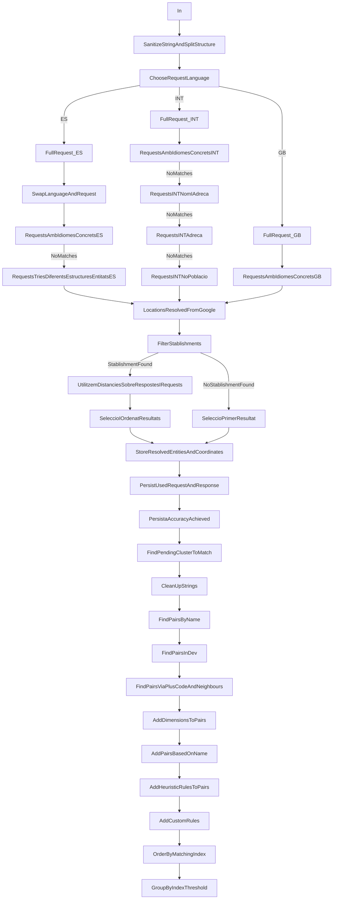

# Matching

In this section, we address the current behavior of the matching process, encompassing its normalization, geocoding components, and ultimately the matching itself. Both the concepts and a functional schema are included.

Recognizing the need for continuous refinement, we have also crafted a dedicated improvement plan. To further understand our commitment to elevating the process, we encourage you to explore the plan in detail available [here](./improvement_plan.md)

## Concepts

- Normalization: Sanitizing of incoming strings & splitting into entities. 
- Geocoding: Resolving coordinates from an address
- Reverse Geocoding: Resolving an address from coordinates
- Matching: The process of identifying two or more address entities as equivalent (representations of the same entity)   

## Current Flow

::: info TODO
- Clarify OV nodes
- Rename nodes
:::

- SanejatString + Split: 
    - ERegs per extracció + Eliminació caracters no desitjats
    - Es forka en fució del país (2 implementacions ES; GB;) 

## Current method

- Algorithm strongly based on coordinate matching, thus, based on normalization.
- Has issues with normalization.
- We are tightly tied to Google as a GeoCoding provider
- Sanitize may be required for old latent georeferenced data