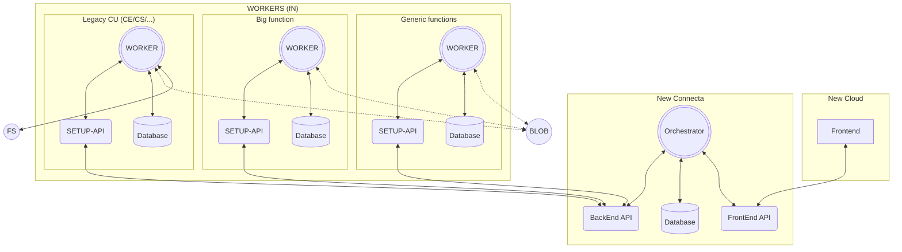

```mermaid

flowchart TD

subgraph "New Cloud"
    NEWCLOUD_FE[Frontend]
end

subgraph "New Connecta"
    NEWCONNECTA_BEAPI(BackEnd API)
    NEWCONNECTA_WORKER(((Orchestrator)))
    NEWCONNECTA_DB[(Database)]
    NEWCONNECTA_FEAPI(FrontEnd API)

    NEWCLOUD_FE<-->NEWCONNECTA_FEAPI
    NEWCONNECTA_WORKER<-->NEWCONNECTA_BEAPI
    NEWCONNECTA_WORKER<-->NEWCONNECTA_DB
    NEWCONNECTA_WORKER<-->NEWCONNECTA_FEAPI
end

subgraph "WORKERS (fN)"

    subgraph "Generic functions"
        GENERIC_FUNCTIONS_API(SETUP-API)
        GENERIC_FUNCTIONS_WORKER(((WORKER)))
        GENERIC_FUNCTIONS_DB[(Database)]

        GENERIC_FUNCTIONS_WORKER<-->GENERIC_FUNCTIONS_API
        GENERIC_FUNCTIONS_API<-->NEWCONNECTA_BEAPI
        GENERIC_FUNCTIONS_WORKER<-->GENERIC_FUNCTIONS_DB
    end

    subgraph "Big function"
        BIGFUNCTION_API(SETUP-API)
        BIGFUNCTION_WORKER(((WORKER)))
        BIGFUNCTION_DB[(Database)]
        BIGFUNCTION_WORKER<-->BIGFUNCTION_API
        BIGFUNCTION_WORKER<-->BIGFUNCTION_DB
        BIGFUNCTION_API<-->NEWCONNECTA_BEAPI
    end

    subgraph "Legacy CU (CE/CS/...)"
        CU_API(SETUP-API)
        CU_WORKER(((WORKER)))
        CU_DB[(Database)]
        CU_WORKER<-->CU_API
        CU_WORKER<-->CU_DB
        CU_API<-->NEWCONNECTA_BEAPI
    end

end

BLOB((BLOB))
FS((FS))
GENERIC_FUNCTIONS_WORKER<-.->BLOB
BIGFUNCTION_WORKER<-.->BLOB
CU_WORKER<-.->BLOB
CU_WORKER<-->FS


```
