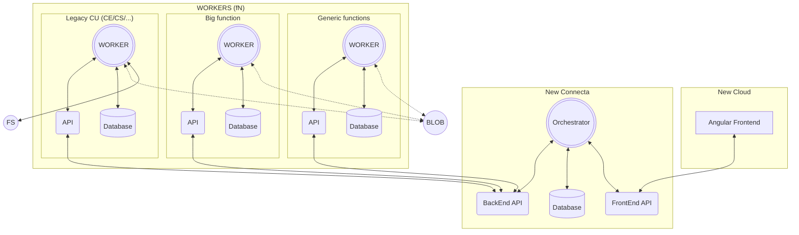

# Architecture

## Methodology

- Create the Orchestrator API, used for frontend API and backend-API.
  - It registers all the workers in BE_API (Initially only CU)
  - Talks to frontend via FE_API
  - Does passthrough of setups from workers to fe.
- Create the CU Worker and API. The API will provide CRUD for the profiles (aka setups) which will be stored in its local storage

## Notes

- APIs on WORKERS are used to configure the profiles or settings for the worker: Ex: CU uses a a list of CuConfigs. Local storage in the unit has everything needed to run the function
- Queues are used to launch jobs. A typical message consists of: BlobID (**Or File in legacies**) and a profileId for the jobSetup.
- Databases are common for each workerType cluster.

### TBD:

- Determine projects & solutions structures
- When CU need to use an extracted FN, will it use orchestration or just talk to the BE-API?
- Who stores the blob when received?
- Define the Interface to extract funcitionality from LegacyWorker (should have the launch, wait, blobManagement capabilities. Work in real cases)

## Schema

