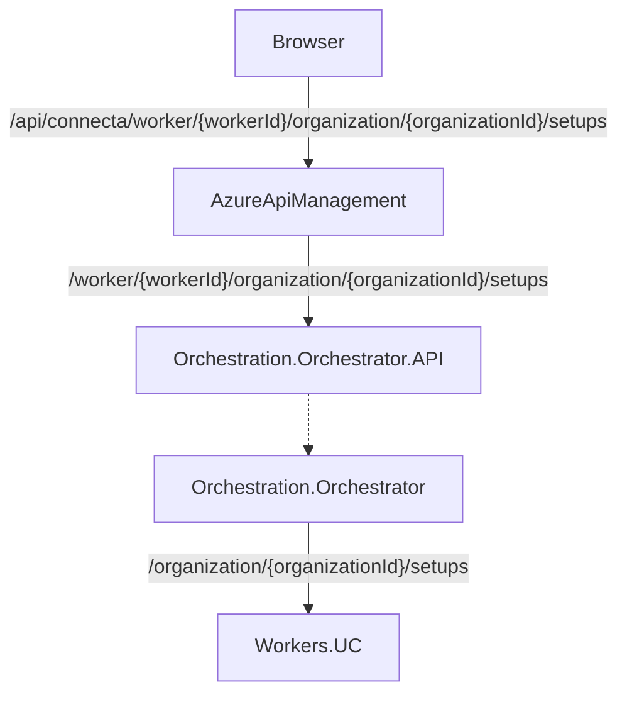

# Example flows

## API Request from Browser in NewCloud to a Worker

This request exemplifies a request from NewCloud frontend to a worker, (in this case, the **Universal Converter Worker**) to fetch the available setups.

### Visual flow



Assuming the worker is the Universal Converter, workerId = **uc**

### Step by step

The steps are as follow:

#### WebBrowser -> ApiManagement

<table>
    <tr>
        <td><b>From</b></td>
        <td><b>Web browser/Client</b></td>
    </tr>
    <tr>
        <td><b>To</b></td>
        <td><b>Azure Api Management</b></td>
    </tr>
    <tr>
        <td><b>Target hostname</b></td>
        <td>{env}.uvesolutions.com</td>
    </tr>
    <tr>
        <td><b>Target URL</b></td>
        <td>/api/connecta/worker/uc/organization/{organizationId}/setups</td>
    </tr>
    <tr>
        <td><b>Auth</b></td>
        <td>SSO Token in header</td>
    </tr>
</table>

#### AzureApiManagement -> Orchestration.Orchestrator

```/connecta``` serves as the ingress filter
Azure API Management, receives the request, authenticates the user and routes request as an ingress. 
It injects the auth token in the request header.

<table>
    <tr>
        <td><b>From</b></td>
        <td><b>AzureApiManagement</b></td>
    </tr>
    <tr>
        <td><b>To</b></td>
        <td><b>Orchestration.Orchestrator</b></td>
    </tr>
    <tr>
        <td><b>Target hostname</b></td>
        <td>???</td>
    </tr>
    <tr>
        <td><b>Target URL</b></td>
        <td>/worker/{workerId}/organization/{organizationId}/setups</td>
    </tr>
    <tr>
        <td><b>Auth</b></td>
        <td>AAM injected Header Token</td>
    </tr>
</table>

#### Orchestration.Orchestrator-> Worker.UC.APIm

The Orchestrator creates a new consumer to request data from the Worker.
Validates the token auth and checks if it has visibility over the provided organizationId (if available)
Outgoing request authentication in this phase is based in network protection & M2M token

<table>
    <tr>
        <td><b>From</b></td>
        <td><b>AzureApiManagement</b></td>
    </tr>
    <tr>
        <td><b>To</b></td>
        <td><b>Orchestration.Orchestrator.API</b></td>
    </tr>
    <tr>
        <td><b>Target hostname</b></td>
        <td>https://connecta-workers-uc-{env}.internal-uvesolutions.com</td>
    </tr>
    <tr>
        <td><b>Target URL</b></td>
        <td>/organization/{oid}/setups</td>
    </tr>
    <tr>
        <td><b>Auth</b></td>
        <td>M2M Token / Network Protection / None</td>
    </tr>
</table>