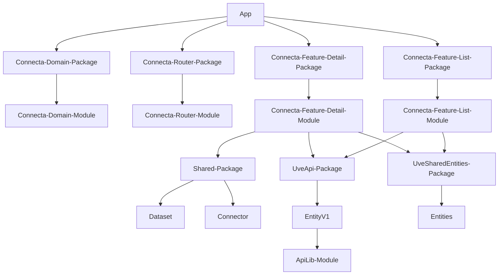
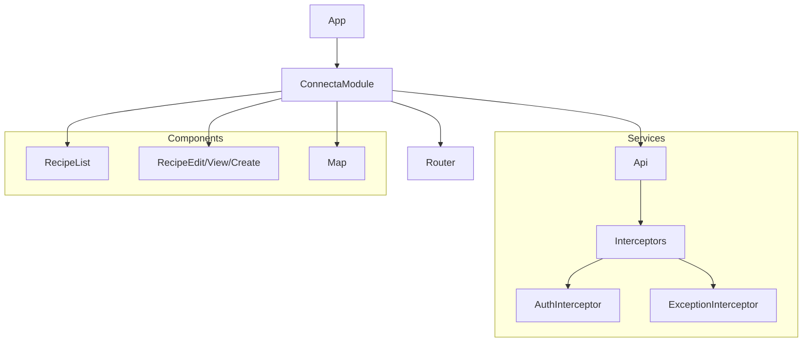
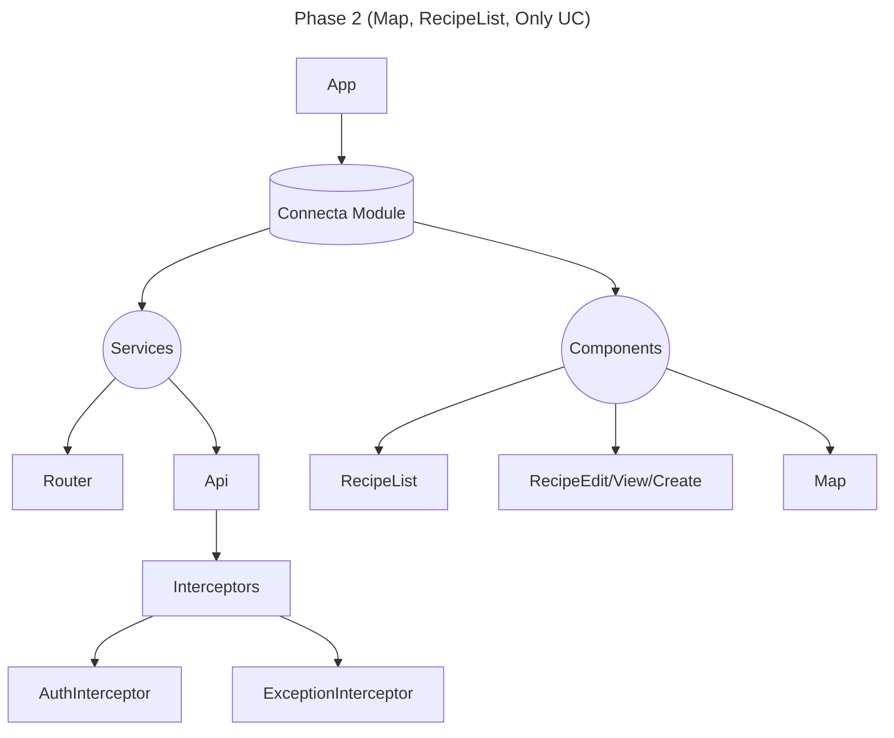
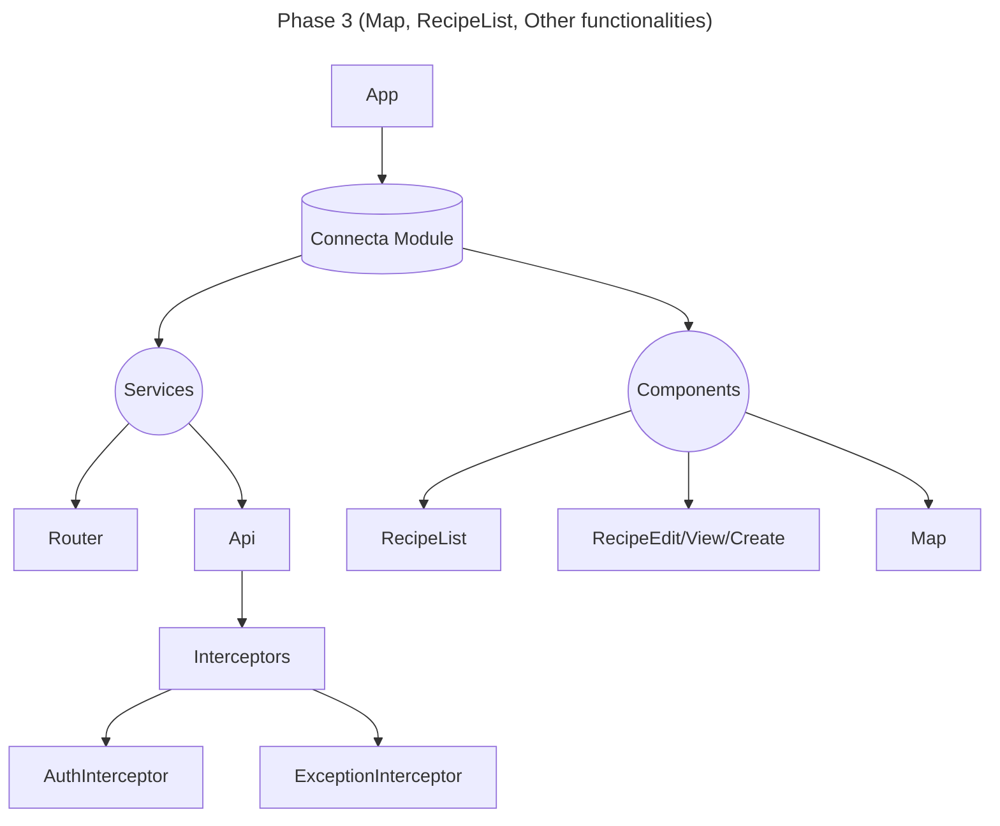

## PHASE 1: UC CRUD

Requirements:
- No requirement for customized components
- Simplification of tool to a simple CRUD of UCSetupç
- No graphical UX requirements
- Possibility to reuse existing API consumers
- Minimal validation & error handling
- Current legacy replication

PROS:
- Quick launch!

## PHASE 2: New architecture

New needs:
- Using overengineered components for the requirements
- Lack of customization
- New version of API consumer required (Not only CRUD or entityVx)
- NewConnecta Tool will require different components, grouped into a module
- Single library for connecta, packing Services (ApiConsumer, etc..) and Components. 

