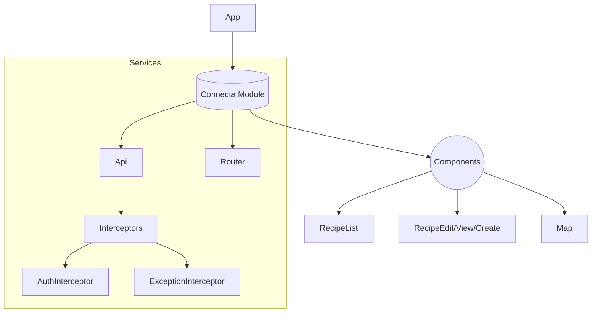
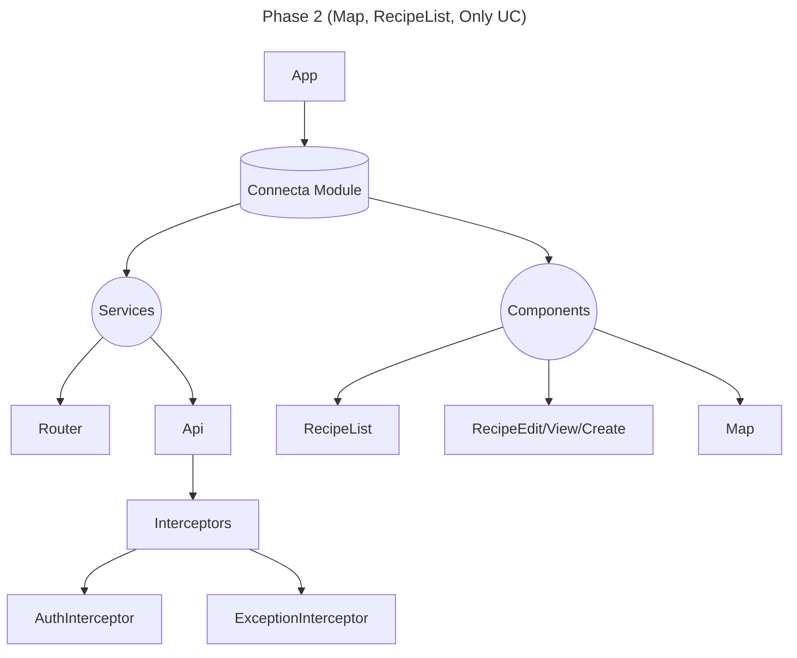
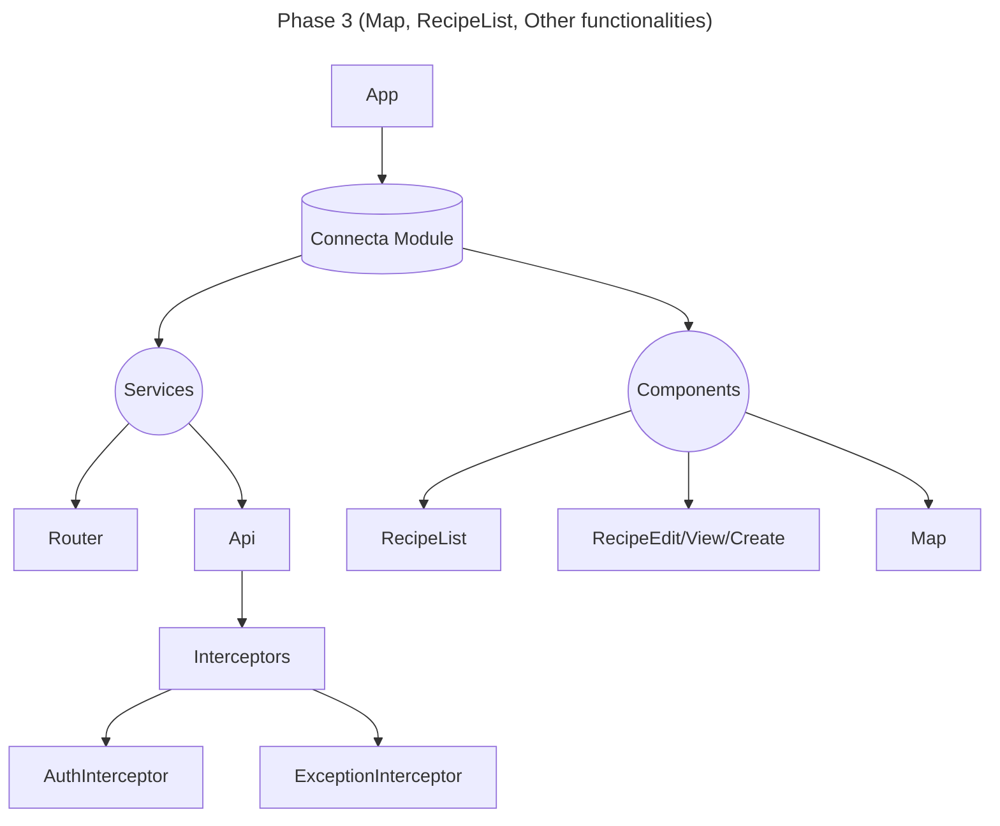

## PHASE 1: UC CRUD

Requirements:
- No requirement for customized components
- Simplification of tool to a simple CRUD of UCSetupç
- No graphical UX requirements
- Possibility to reuse existing API consumers
- Minimal validation & error handling
- Current legacy replication

PROS:
- Quick launch!
CONS:

```mermaid

flowchart TD

    App --> Connecta-Domain-Package --> Connecta-Domain-Module
    App --> Connecta-Router-Package --> Connecta-Router-Module
    
    App --> Connecta-Feature-List-Package --> Connecta-Feature-List-Module
    Connecta-Feature-List-Module --> UveApi-Package 
    Connecta-Feature-List-Module --> Connector
    Connecta-Feature-List-Module --> Dataset
    
    App --> Connecta-Feature-Detail-Package --> Connecta-Feature-Detail-Module
    Connecta-Feature-Detail-Module --> UveApi-Package 
    Connecta-Feature-Detail-Module --> Connector
    Connecta-Feature-Detail-Module --> Dataset

    UveApi-Package --> EntityV1 --> ApiLib

    UveSharedEntities-Package Entities

```
## PHASE 2: Recipe,Map & UC 








