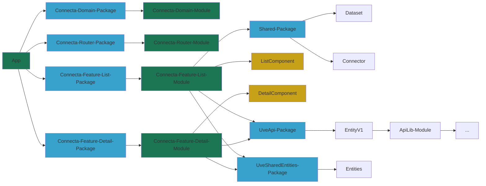
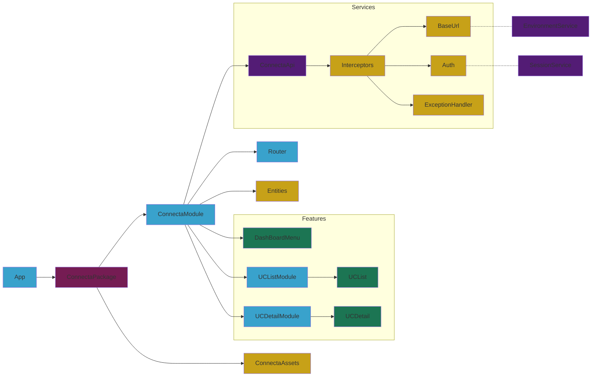
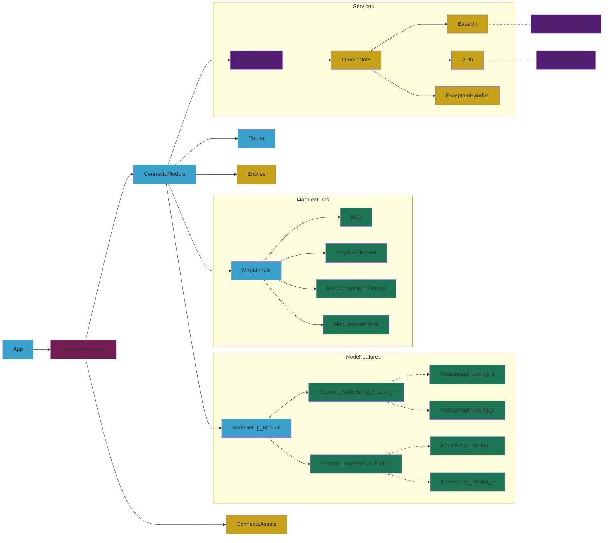

## PHASE 1: UC CRUD

Requirements:

- No requirement for customized components
- Simplification of tool to a simple CRUD of UCSetup
- No graphical UX requirements
- Possibility to reuse existing API consumers
- Minimal validation & error handling
- Current legacy replication

PROS:

- Quick launch!

## PHASE 2: New architecture

New needs:

- A wider catalog of components and features
- Simplification of structures due to complexity of content
- More customization of content
- Specific version of API consumer, non opinionated usage (Not only CRUD or entityVx)

# PHASE 3: Recipes, Maps & increased complexity

New needs:

- Increased complexity
- Map features

