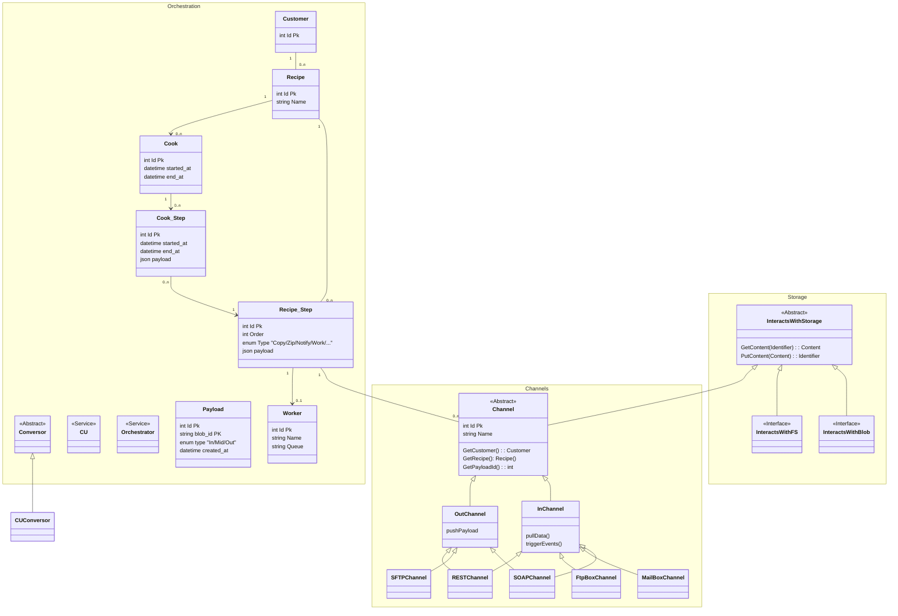
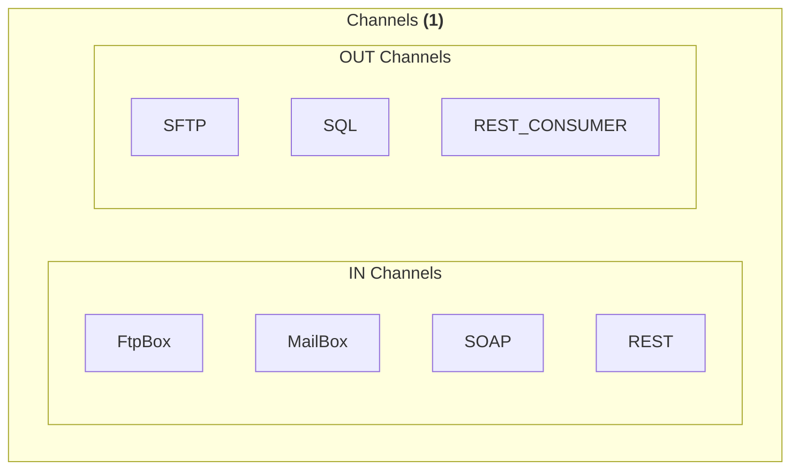

# New connect general diagram

## General Class map

## GENERAL CONCEPTS
- A legacy recype may exist (agents will always return a recipe, customer and a payload)

## Functional groups

### Channels

- Will need to be able to identify User/[Recipe|LegacyRecipe]

#### TODO
1. Adopt new interfaces (and Interface extensions)

#### BLOCKING TODO

Type: [uService, Library, Class, ???]
Trigger Interaction: [Messeges, direct calls, ]
Data Interaction: [Blob, FS, ...]

