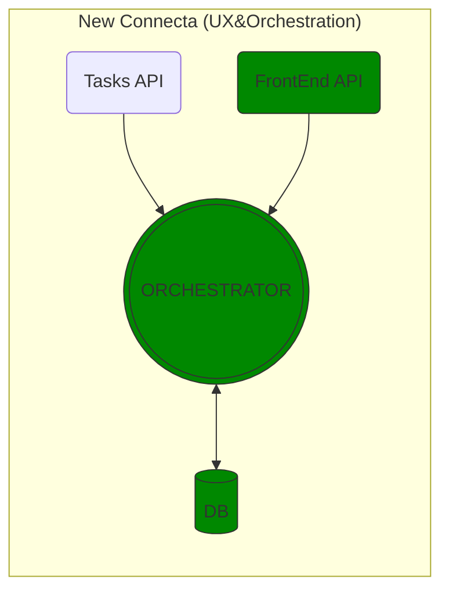
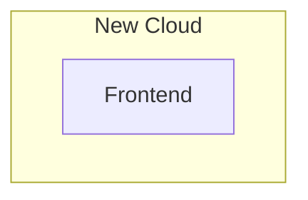

# Phase 01: Architecture scaffolding MVP

## Milestone

Configure CU via New Cloud's interface

## Affected blocks

```mermaid

<!--@include: ../architecture/map.md-->

style NEWCONNECTA_WORKER fill:#080,stroke:#333
style NEWCONNECTA_FEAPI fill:#080,stroke:#333
style NEWCONNECTA_DB fill:#080,stroke:#333
style F1_API fill:#080,stroke:#333
style F1_DB fill:#080,stroke:#333
style NEWCLOUD_FE fill:#080,stroke:#333
linkStyle 1 stroke:#080
linkStyle 2 stroke:#080
linkStyle 4 stroke:#080
linkStyle 5 stroke:#080
linkStyle 6 stroke:#080
linkStyle 12 stroke:#080

```

## Step by step:

1. [Develop the Orchestrator for NewConnecta.](#step-1-develop-the-orchestrator-for-newconnecta)
2. [Provide a frontend API interface through NewConnecta's Orchestrator.](#step-2-frontend-api-on-the-orchestrator)
3. [Enable the UC to manage its configurations via its dedicated API.](#step-3-cu-management-api)
4. [Integrate the UC API service within NewConnecta's Orchestrator and relay it to the frontend API.](#step-3-cu-management-api)
5. [Design a comprehensive set of frontend components to manage the configurations of the UC service.](#step-4-frontend-and-components)

## Section details

### Step 1: Develop the Orchestrator for NewConnecta.

A brand new project, along with its entire data model & database, to represent the entity of the new orchestrator.

This entity or application will soon be responsible for managing newly created recipes. Moreover, during the initial phase, it will be responsible of the relaying of the workers API's to the front-end.

It will use its local database, for which a data model has been developed and can be accessed at the provided reference, [here](../classmap.md) ('Orchestration' section)



### Step 2: Frontend API on the Orchestrator.

### Step 3: CU management API

### Step 4: Frontend and components



- Determine frontend and uServices frontend strategies:
  - MicroFrontend & Lazy Loadings
  - MonoRepo & Nx?
    Pending NewCloud team review
