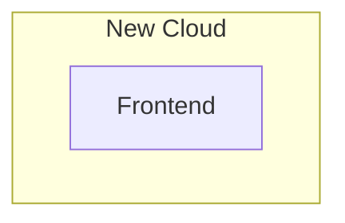

# Phase 01: Architecture scaffolding MVP

## Milestone

Configure CU via New Cloud's interface

## Affected blocks

```mermaid

<!--@include: ../architecture/map.md-->

style NEWCONNECTA_WORKER fill:#080,stroke:#333
style NEWCONNECTA_FEAPI fill:#080,stroke:#333
style NEWCONNECTA_BEAPI fill:#080,stroke:#333
style NEWCONNECTA_DB fill:#080,stroke:#333
style F1_API fill:#080,stroke:#333
style F1_DB fill:#080,stroke:#333
linkStyle 0 stroke:#080
linkStyle 1 stroke:#080
linkStyle 2 stroke:#080
linkStyle 4 stroke:#080
linkStyle 5 stroke:#080
linkStyle 6 stroke:#080
linkStyle 12 stroke:#080

```

## Step by step:

- Develop the Orchestrator for NewConnecta.
- Provide a frontend API interface through NewConnecta's Orchestrator.
- Enable the UC to manage its configurations via its dedicated API.
- Integrate the UC API service within NewConnecta's Orchestrator and relay it to the frontend API.
- Design a comprehensive set of frontend components to manage the configurations of the UC service.
- Implement the necessary architectural framework to oversee the entire workflow.

## Section details

### Frontend



- Determine frontend and uServices frontend strategies:
  - MicroFrontend & Lazy Loadings
  - MonoRepo & Nx?
    Pending NewCloud team review

## Phase 2: Transforming Workers & Adopting µServices

## Phase 3: PowerUp the Orchestrator

## Phase 4: Connectors
