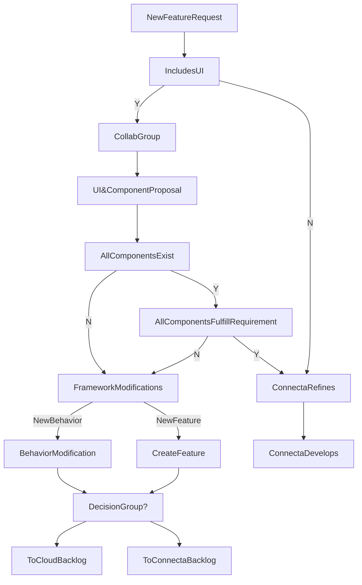

# NewConnecta new feature team interactions

### CollabGroup

- Patricio (Cloud)
- Cristina (UI)
- Marc (Connecta)

### DecisionGroup

- Jesus
- Joel
- Jordi?

```mermaid

flowchart TD

    DecisionGroup[DecisionGroup?]

    NewFeatureRequest --> IncludesUI

    IncludesUI --Y--> CollabGroup
    CollabGroup --> UI&ComponentProposal --> AllComponentsExist
    AllComponentsExist --N--> FrameworkModifications
    AllComponentsExist --Y--> AllComponentsFulfillRequirement
    AllComponentsFulfillRequirement --N--> FrameworkModifications
    AllComponentsFulfillRequirement --Y--> ConnectaRefines

    FrameworkModifications -- NewBehavior --> BehaviorModification --> DecisionGroup
    FrameworkModifications -- NewFeature --> CreateFeature --> DecisionGroup

    DecisionGroup --> ToCloudBacklog
    DecisionGroup --> ToConnectaBacklog


    IncludesUI --N--> ConnectaRefines --> ConnectaDevelops

```
