# CAX RoadMap

## Confección infra CAX

### Objetivos:

- Reducción de coste, complejidad y mejora velocidad desarrollo: +Developer experience!
- Mejora visual, en estabilidad y confiabilidad: +User experience!

### Done steps:

- MVP Connecta: Sustitución DetailService y componentes shared por sistema templates y componentes standard (UVE_Framework_MVP)

- Replanteamiento libreria de componentes UVE:

  - Estandarzar (requisito para incorporarlos al CAX)
  - Eliminación costes en diseño y desarrollo funcional de componentes UI

- Adopción de tailwind (resolución spaghetti CSS)
- PoC con DaisyUI para diseño componentes (FAIL)
- PoC con PrimeNG (On TEST) -> Cambia el rol de UVE del desarrollador a usuario de framework de UX

### Next steps:

- Integrar al PoC PrimeNG-UveFramework a MVP
- Mover UveFramework_MVP a UveFramework, cleanUp de componentes
- Actualizar Connecta usando UveFramework_MVP a UveFramework
- Validación diseño UX
- Validación coexistencia PrimeNG

## Implementación 'CAX'

- Implementación de UveFramework en pantalla Actividades. (TBD!)
- Identificación de los Componentes problematicos para convertirlos a UveFramework (AutoComplete)
- Pendiente analisis: Podemos usar Mantenimiento de tablas dentro de un CAX?.

**W09**

```mermaid

flowchart TD

    classDef primary fill:#48caff
    classDef secondary fill:#29a979
    classDef accent fill:#fbcb1f
    classDef neutral fill:#0b0517
    classDef base100 fill:#fcfcfc
    classDef info fill:#00e0ff
    classDef success fill:#00d181
    classDef warning fill:#d18100
    classDef error fill:#d10000

    TailwindCloudIntegration:::secondary --> TwCompatibilityCheck:::secondary --> DaisyPoc:::error

    UVE_Framework_MVP:::secondary --> ConnectaMVP
    EntityDetail:::secondary --> ConnectaMVP
    ConnectaMVP:::secondary  --> ConnectaDetailCAX:::secondary --> ConnectaDetailPrimeNG:::primary -.-> CAX_MVP



    UveComponentFramework --> CAX_MVP:::primary -.-> TBD((TBD)):::base100

    TwCompatibilityCheck:::secondary --> CAX_MVP
    PrimeNgPoc:::secondary --> PNgCompatibilityCheck:::primary --> UveComponentFramework:::accent

    ValidationLibrary:::accent --> FrontValidation
    CustomValidation:::secondary --> FrontValidation
    CrossValidation:::accent --> FrontValidation
    FrontValidation:::accent --> ValidationCAX:::primary -.-> CAX_MVP

    MantenimientoTablasWrapper:::primary --> CAX_MVP

```

