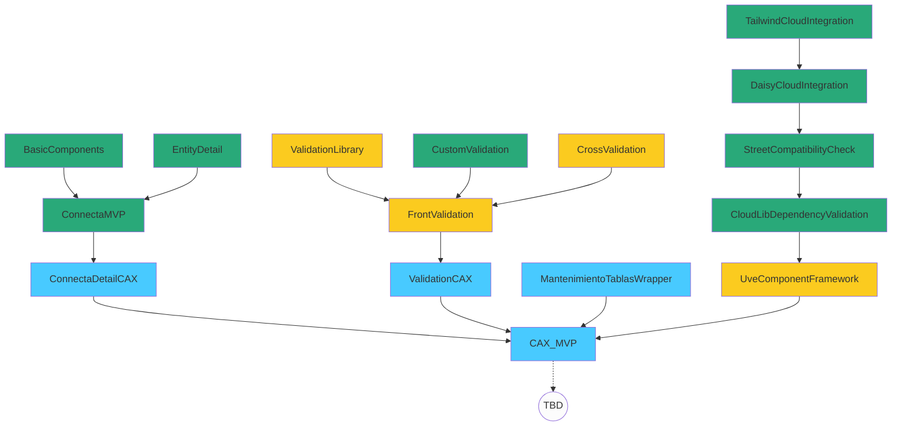

# Cloud RoadMap

**W09**

```mermaid

flowchart TD

    classDef primary fill:#48caff
    classDef secondary fill:#29a979
    classDef accent fill:#fbcb1f
    classDef neutral fill:#0b0517
    classDef base100 fill:#fcfcfc
    classDef info fill:#00e0ff
    classDef success fill:#00d181
    classDef warning fill:#d18100
    classDef error fill:#d10000

    BasicComponents:::secondary --> ConnectaMVP
    EntityDetail:::secondary --> ConnectaMVP
    ConnectaMVP:::secondary  --> ConnectaDetailCAX:::primary --> CAX_MVP

    ValidationLibrary:::accent --> FrontValidation
    CustomValidation:::secondary --> FrontValidation
    CrossValidation:::accent --> FrontValidation
    FrontValidation:::accent --> ValidationCAX:::primary --> CAX_MVP

    TailwindCloudIntegration:::secondary --> DaisyCloudIntegration:::secondary --> StreetCompatibilityCheck:::secondary --> CloudLibDependencyValidation:::secondary --> UveComponentFramework:::accent

    MantenimientoTablasWrapper:::primary --> CAX_MVP

    UveComponentFramework --> CAX_MVP:::primary -.-> TBD((TBD)):::base100
```
