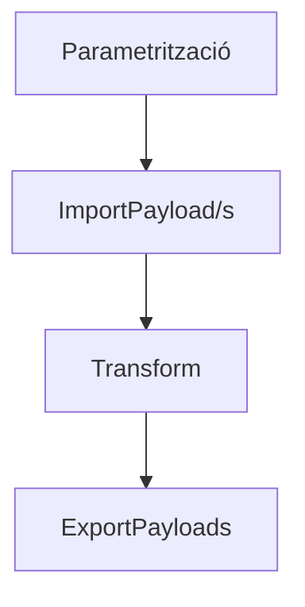

# PROCÉS IDEAL

## Default plugins

### Logging

- Logger.Send(msg, level, [channel])

### Logging Channel

Plugins for the logging plugin

- Mail
- Kibanna
- Webhook
- DB

### Payload (Tabular data massive sources)

Implementations: Blob, FS, API

- PayLoad
  - Batch
    - AddContent(Name, Content)
    - GetContent(Id)
  - Backup
  - Restore

### Entity (Non massive, mappable entities CRUD)

- API
- DB
- EntityFramework

### DTOs (Should be fixed in microkernel, or scoped in plugins)

- Target output nomenclators
- Target API mappings
- EntityFramework DB mappings

## FLUX

