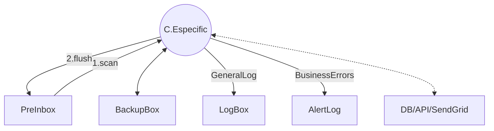
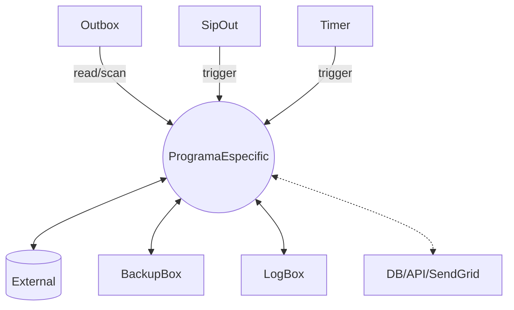
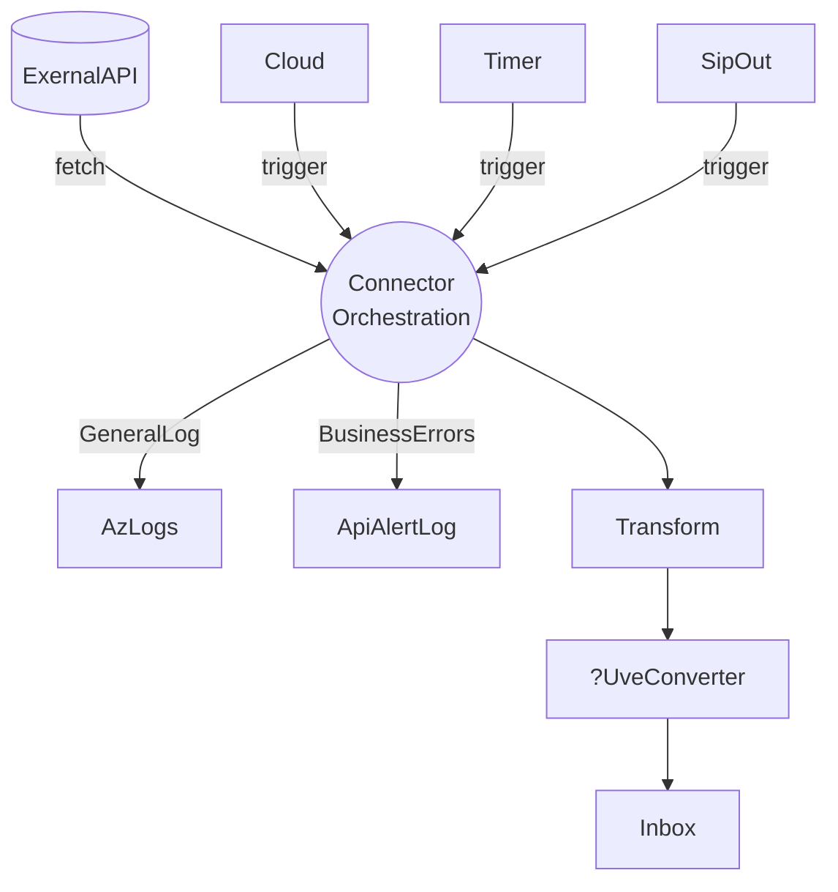
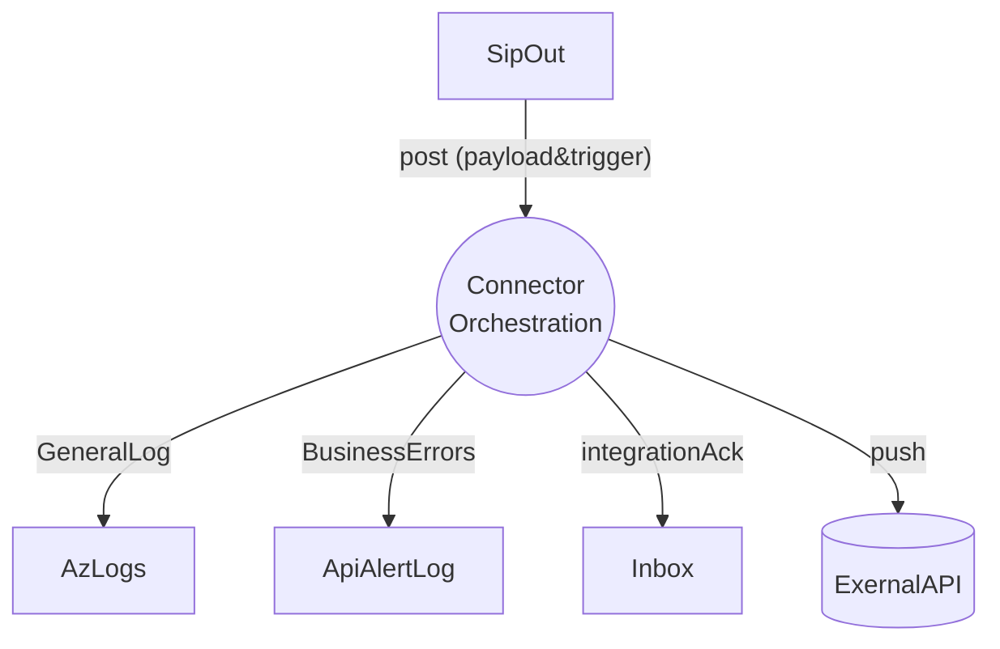
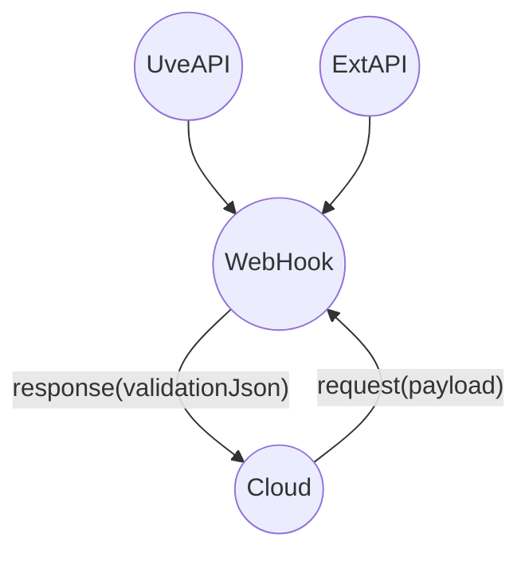

- Accés a repos
- Analitzem casos reals i estructures tipus de projecte

## Anàlisis Tipus:

### Convertidor:

- Treballa files amb preinbox.
- Agafa segons màscara.
- Interacciona amb la outbox

- Detecta a pre -> mou a bk -> treballa amb bk

### Programa específic

- Entrada out/api/DB
- Trigger via bat

### Connector

- @AzFn

- Endopoints UVE / External
- Sentit In o Out

**imports**

**exports**

### WebHook

- No access to DB nor FS
- Reactive
- @AzureFN

## Conclusions

- Els punts de contacte amb ConnectaSDK són pocs.
- Detectats 4 tipus base de projecte (2 locals/2 AzFN)
- Possibilitat de substituir projectes a AzFN de les plantilles a flux modular amb contractes (una instància, múltiples dll)
- Possibilitat d'extreure els projectes locals a AzFn: Caldria abstreure la gestió de fitxers i l'accés a DB.

## TODO

- Traslladar esquemes fotos
- Plantejar arquitectura modular (Connectors/WebHooks Sergio)
- Valoració funcionalitats AzFN vs AKS?
- Valorar AzFN com a solució definitiva (validar amb infra, preus, escalat, tunnels DB, blobs)
- Plantejar solucions per moure tot a AzFN (Solucions per accés a DB i abstracció de fitxers)

- Fer informe de conclusions JC
  - Què volem per Connecta SDK (Poca sinergia amb Connecta SDK)
  - Possibilitat de migrar Custom a pocs projectes escalables i modulars
  - Possibilitat de migrar tot a AzFN (o AKS?)
