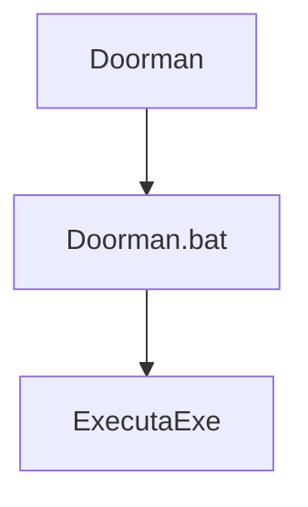
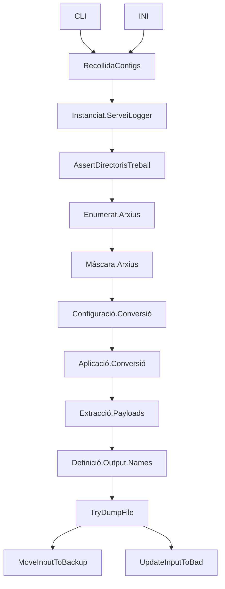
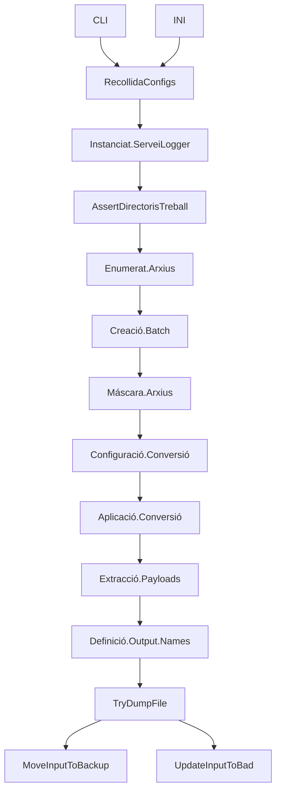

# Session 240123

- Analisis de projectes

## Idees

- Definir fluxe dels Webhooks segons explicat i trobar els punts comuns amb els conversors
- Definir mòduls funcionals i interfaces

- DataAccess podria fer updates?

- Paquet abstracte d'accés a entitats (Entity / DB)
  - EntityFramework paquet d'entitats per DB
  - ApiClient paquet d'entitats
- Paquet File/Batch (gestió payloads, backups, renombrats, .bad)

- Servei de tasks

- Seguretat de les AzFn (via token, però quin flow????)

## Generics

Triggering tipus exe:



### Paquet/Servei de Logging

Té comportament que es pot abstreure.
Parametres: - Target file del log - Configuracións de canals (email, API, etc...)

```json
channels: {
    { name: 'file', 'param1': ....},
    { name: 'alertLog', 'param1': ....},
}
levels : {
    'info': [ 'file']
    'warning': [ 'file', 'alertLog']
}
```

## Converter (PernodPDF/JsonAta)

- Converter
- SDK 4.7.1
- Tipus EXE
- Arguments de multiples fonts
  - CLI (Prové del doorman.bat)
  - .Ini (S'espera sempre en la mateixa ubicació, pot venir per parametre)



## Connector (DDI/SAP)

- Hosted a Servidor


