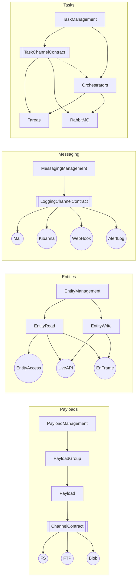

# Paquets proposats


**Messging vs Logging han d'incloure els dos!!!!! **

## Gestió de payloads
  - Gestió dels batches
  - Gestió dels backups, snapshots, ...
  - FileSystem __*__
  - Blobs
  - FTP/SFTP
  - API? ()...

### Implementacions

```mermaid

flowchart TD
  

```


```C#

// Batches


// NewPayloads
var newPlayload = new Payload(Id = null);
var payloadId = newPayload
  .SetChannel(Channel.Filesystem)
  .SetContent('content')
  .Store()
;

// Existing
var existingPayload = new Payload(Id);
var content = existingPayload.GetContent();
var snapshotId = existingPayload.Snapshot();
var content = existingPayload.RestoreSnapshot(snapId).GetContent();

var Payload = new Payload(Id = null);
  Payload
    .Snapshot() // Return snap Id
    ...
    .GetContent()

  - Backup
  - Restore

enum Channel {
  FileSystem,
  Blob,

}

```


## Accés a entitats
    - Via API (client API + DTOs)
    - Via DB (EF + DTOs) __*__ (On està la entity framework. Parlar amb l'Oriol) 
    - Via DataAccess API (Parlar amb l'Estanis) Problemes de visibilitat a info privilegiada.

## Configuradors / Parametritzadors
    - Multiple config providers (Parlar amb el Sergio)

## Gestor de tasques (Tareas)?? __*__

## Messaging&Logging **??**
  - Logger.Send(msg, level, [channel])
    - Kibana Logs __*__
    - Webhooks
    - Mail

### Logging Channels

Plugins for the logging plugin

- Mail
- Kibanna
- Webhook
- DB

## Entity (Non massive, mappable entities CRUD)

- API
- DB
- DataAcess
- EntityFramework

### DTOs (Should be fixed in microkernel, or scoped in plugins)

- Target output nomenclators
- Target API mappings
- EntityFramework DB mappings