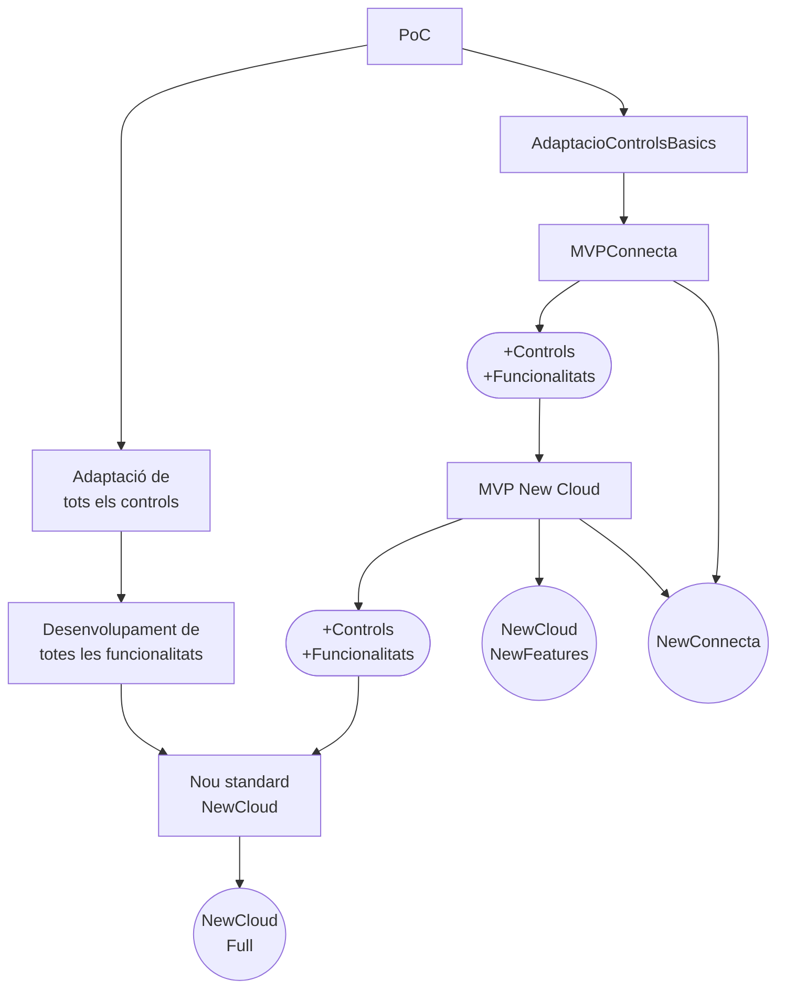

# MVP arquitectura ModelDetail NewCloud

## Situació actual

- ConnectaTeam té un problema de productivitat/estabilitat utilitzant l'eina __DetailService__ i __SmartForm__ de NewCloud. 
- Els principals motius del problema de Connecta poden ser parcialmente tant el desconaixament de l'eina i com que aquesta presenti disFuncionalitats.
- NewCloudTeam està tenint dificultats acabar la producció de la pantalla de Clients utitzant aquestes eines. 
- ConnectaTeam ha proposat i elaborat una PoC d'una arquitectura més senzilla, que proporcioni les principals funcionalitats combinades d'aquests dos elements (SmartForm + DetailService).

## Resultat de la PoC

- La PoC ha estat, en general, satisfactòria. 
- Hi ha alguns dubtes tècnics a aclarir, però no s'identifiquen com a stoppers. 
- En Jesus ha exposat alguna reticència al respecte de la definició dels formularis en templates vs en estructures TS. 
- La implantació d'aquesta arquitectura implicaria la estandarització dels components/controls 'shared' que s'utilitzin.
- CloudTeam planteja l'opció de convertir la PoC en nou standard per NewCloud sempre que compleixi el plec de requisits. Això facilitaria la finalització dels projectes en curs de NewCloud.

## Next steps

- Recollir els requisits funcionals per crear:
    - Un nou standard a tot NewCloud: 
        
        https://www.notion.so/uvesolutions/Requisitos-View-Builder-01af36d25147447fab1878ae6689b07c
    - Un MVP d'aplicació transversal a NewCloud
    - Un MVP d'aplicació a NewConnecta
- Amb els requisits, pressupostar la conversió de la PoC a cadascun dels possibles productes.
- Si es veu viable, acotar l'estratègia, l'equip i la planificació per executar algun d'aquests MVPs

## Possibles outcomes

