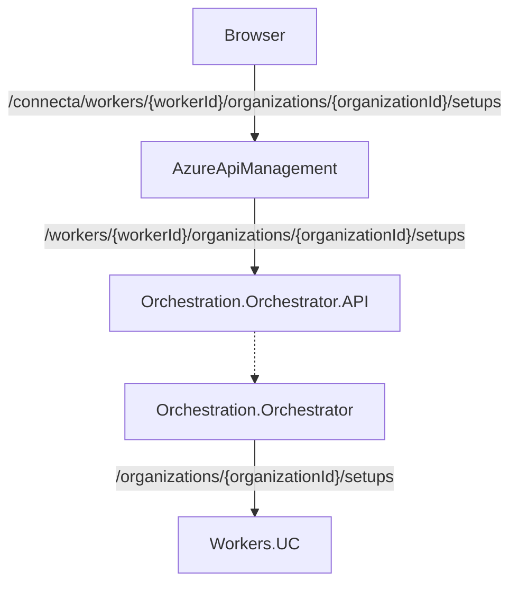

# Example flows

## API Request from Browser in NewCloud to a Worker

This request exemplifies a request from NewCloud frontend to a worker, (in this case, the **Universal Converter Worker**) to fetch the available setups.

### Visual flow




Assuming the worker is the Universal Converter, workerId = **uc**

### Step by step

The steps are as follows:

#### WebBrowser -> ApiManagement

<table>
    <tr>
        <td><b>From</b></td>
        <td><b>Web browser/Client</b></td>
    </tr>
    <tr>
        <td><b>To</b></td>
        <td><b>Azure Api Management</b></td>
    </tr>
    <tr>
        <td><b>Target hostname</b></td>
        <td>api.uve.ai</td>
    </tr>
    <tr>
        <td><b>Target URL</b></td>
        <td>
            /connecta/workers/{workerId}/organizations/{organizationId}/setups (Prod)<br/>
            /connecta/{$env}/workers/{workerId}/organizations/{organizationId}/setups (Other envs)
        </td>
    </tr>
    <tr>
        <td><b>Auth</b></td>
        <td>SSO Token in header</td>
    </tr>
</table>

#### AzureApiManagement -> Orchestration.Orchestrator

- ```/connecta``` serves as the ingress filter for Azure API Management
- AAM receives the request and authenticates the user injecting the header token.
- AAM routes request as an ingress to Connecta.Orchestration.Orchestrator's API

<table>
    <tr>
        <td><b>From</b></td>
        <td><b>AzureApiManagement</b></td>
    </tr>
    <tr>
        <td><b>To</b></td>
        <td><b>Orchestration.Orchestrator</b></td>
    </tr>
    <tr>
        <td><b>Target hostname</b></td>
        <td>connecta-orchestration-orchestrator-{$env}.internal-uvesolutions.com</td>
    </tr>
    <tr>
        <td><b>Target URL</b></td>
        <td>/workers/{workerId}/organizations/{organizationId}/setups</td>
    </tr>
    <tr>
        <td><b>Auth</b></td>
        <td>AAM injected Header Token</td>
    </tr>
</table>

#### Orchestration.Orchestrator -> Worker.UC.APIm

- The Orchestration.Orchestrator API receives the request, and validates the auth token.
- The path ```/workers/{workerId}``` indicates the target for the new consumer to be created (stored locally as an entity)
- If visibility check is required for the requested entity (p.ex by organizationId), it uses th token to validate it
- The Orchestration.Orchestrator creates a new consumer to request data from the Worker.
- This new consumer in this phase is based in network protection & M2M token

<table>
    <tr>
        <td><b>From</b></td>
        <td><b>AzureApiManagement</b></td>
    </tr>
    <tr>
        <td><b>To</b></td>
        <td><b>Orchestration.Orchestrator.API</b></td>
    </tr>
    <tr>
        <td><b>Target hostname</b></td>
        <td>connecta-workers-uc-{$env}.internal-uvesolutions.com</td>
    </tr>
    <tr>
        <td><b>Target URL</b></td>
        <td>/organizations/{organizationId}/setups</td>
    </tr>
    <tr>
        <td><b>Auth</b></td>
        <td>M2M Token / Network Protection / None</td>
    </tr>
</table>