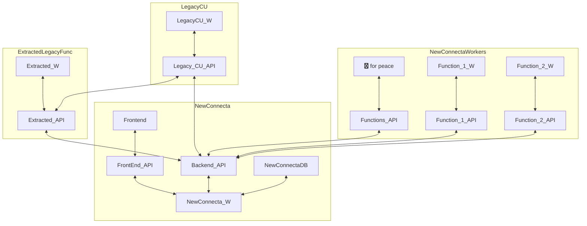

# MILESTONE: Graphical Angular editting of legacy CU in NewCloud 

## Assumptions
- The main model is CUConfig (Related to Customer)
- The main UX is consists of and indexer (CRUD) + editor

## Tasks

### API
- Define the API location for CU service
    - New project (Name: New Connecta, New project)

- Create an API to export of the CUConfigs
    - In the new project
- Expose existing CUConfigs for a user (simple view)
- Render the list of configurations available in the NewConnecta Interface
- Allow deletion and creation of new CUs. in FE.
- Allow deletion and creation of new CUs. in BE. Validations?
- Discover NewCloud, structure & possiblities  
- Define the CU configuration UX interface window
- Define the locations where the components wil reside
- Define the UX locations of the new CU Editor
- Create the set of Angular components to handle a CUConfig (Create+Edit)
- Define business rules & validations for the CUConfig FE. 
- Handle POST of settings for a CUConfig (Create & edit)