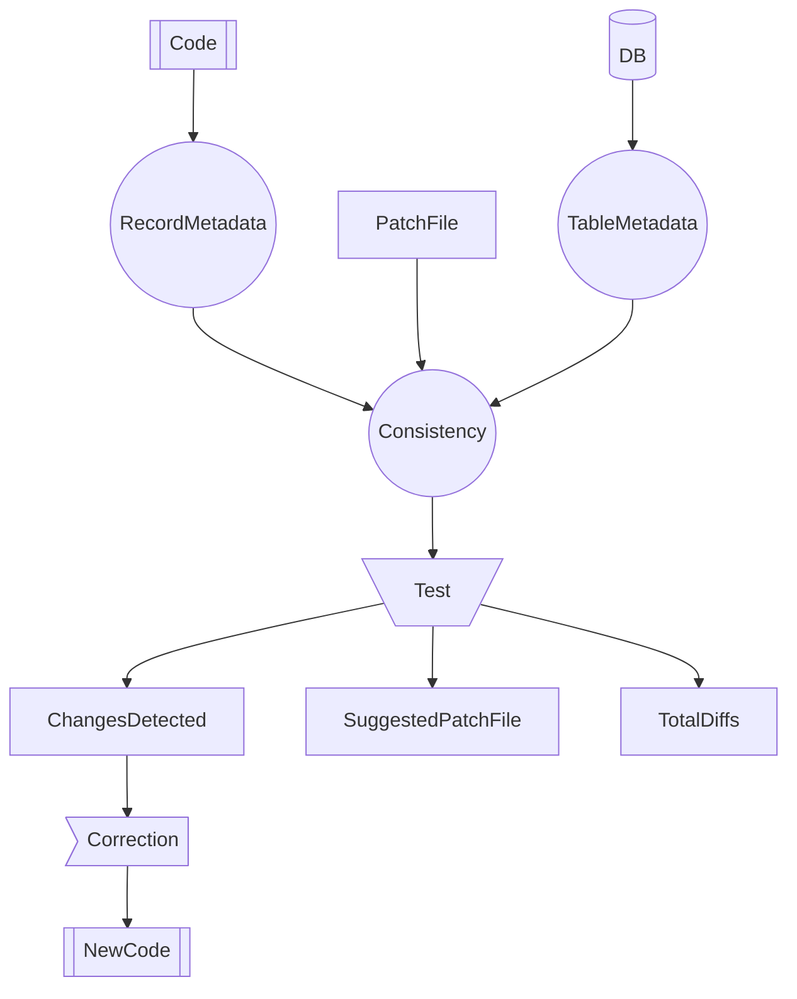
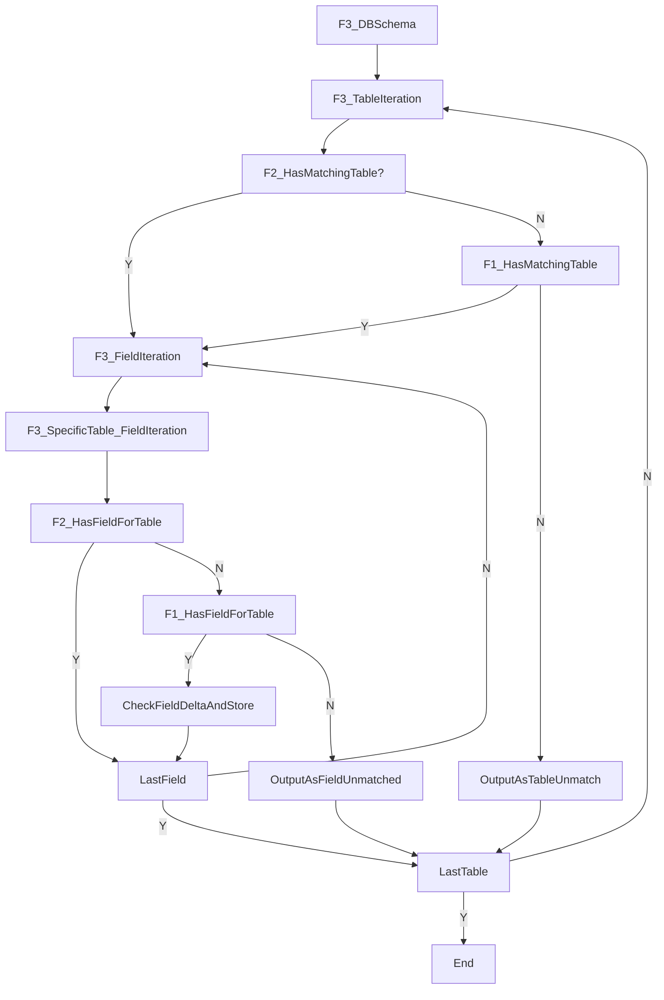

# Record consistency check

## Overview

This project conducts a series of tests to validate the definitions within each record (RecordDefinition) against the definitions in the database. It leverages an automatic identification algorithm and a patch file to facilitate the necessary adaptations between the two.

It is mainly oriented to fix all uses of this information, but mainly the one rendered at the [developer portal](https://dev.uve.ai/api/connecta/structures)

## Features

- **Automatic Identification Algorithm:** Compares and identifies fields across three sources.
- **Patch File System:** Allows for manual adjustments to achieve a perfect match between database and record definitions.
- **Validation Service:** Validates field types and lengths for consistency, reporting any discrepancies.
- **JSON Patch Imports:** Supports importing patches from a JSON file.
- **Comprehensive Reporting:** Outputs all differences and provides a 'Reports' folder containing detailed results.

## How does it work?



## Reports Folder Contents

1. **`missmatchesAndDiffs.json`:** Raw information on discrepancies (internal use).
2. **`suggestedPatchesTemplate.json`:** A template for partial identifications, facilitating manual completion to generate a new patch for a complete match.
3. **`recordChangesIdentified.json`:** Changes required in records, identified through database-record mismatches. This can be automatically processed by the mass adjustment project.

## Patch Filling Process

To fill the `suggestedPatchesTemplate`, locate null fields, populate them, and convert the file into the new patch. This iterative process may reveal new mismatches.

## Patch System Functionality

- **Default Table Configuration:** Each record can have a default table configuration.
- **Specific Table Specification:** Record Properties can specify different target tables if they don't align with Record default one.
- **Diff Ignore Flag:** Tables and properties can be marked as 'ignorable' using `diffIgnore: true`.

## Usage

Run the test locally and observe the results in the ignored 'Reports' folder within the repository. Aim for:

1. A `suggestedPatchesTemplate` without nulls for a perfect match.
2. An empty `recordChangesIdentified`, indicating no system inconsistencies.

## Patch File Examples

### Example 1: Inability to Find Matching Table

In cases where a matching table can't be found, the `TargetTable` field should be filled. `Properties` remains null, as field processing is ineffective without a specified table.

```json
{
  "RecordName": "ActividadesAgente",
  "DiffIgnored": false,
  "TargetTable": null,
  "Properties": null
},
```

### Example 2: Manually Identified Table, Some Fields Unidentified

Here, the table has been manually mapped and fields processed. Note two field entries:

1. A field manually mapped to a different table and field name.
2. A field using the record's table, with "PropertyNameInTable" unidentified.

```json
{
  "RecordName": "ActividadesAcciones",
  "DiffIgnored": false,
  "TargetTable": "ActividadAcciones",
  "Properties": [
    {
      "PropertyNameInRecord": "CodigoAgenteDestino",
      "DiffIgnored": false,
      "TargetTableName": "ActividadesGestores",
      "PropertyNameInTable": "IdcAgenteDestino"
    },
    {
      "PropertyNameInRecord": "TipoAgenteDestino",
      "DiffIgnored": false,
      "TargetTableName": "ActividadAcciones",
      "PropertyNameInTable": null
    }
  ]
}
```

**If a record is not listed in this file, it indicates that all processing has been successfully automated.**

## Flow

- F1 = Records (JSON)
- F2 = Patch (JSON)
- F3 = DB Schema
- F4 = Updates to F1


