[](https://dev.azure.com/uvesolutions/UveCore/_build/latest?definitionId=50&repoName=_uve_%2Fuvecore&branchName=master)

[](https://dev.azure.com/uvesolutions/UveCore/_build/latest?definitionId=50&repoName=_uve_%2Fuvecore&branchName=develop)

# UVE-CORE

This solution aims to be the main application core having all the model, domains and logic in it.

There are several projects included here, each one has an specific function:

- _CargaDataMart_: This project is the container for all the named "nightly process"

- _CargaDataMartWinService_: This project helps us installing a service in windows machine running CargaDataMart

- _UveCore_: Here we'll have the main Uve application core, having the service, repository and model layers. Also cross
  tools as DB Migrations.

- _UveCoreTests_: We have to place all the tests belonging to the UveCore here.

- _SampleExeFile_: A helper project that generates a very silly .exe that we need for unit testing purposes.

It's important to mention that one of the goals we've is to move the projects inside connecta to that solution, and
study if we can move the projects in API solutions here also.

Also it's important to mention that we can get the .ddl from UveCore and place it in any project we want (for example in
the API project if we want to have it in separate solution at the end), so all the Uve projects will be able to benefit
from this. Because of that, is very important to architect and design the code in UveCore having that in mind, we don't
have to think in a service having the API in mind, instead of that, we must think on what does the service itself.

## Branching Model -> Adaptación de Git Flow

Usaremos una [adaptación de Git Flow](https://bitbucket.org/_uve_/gitversionpoc/src/develop/) que cubre las necesidades de la solución y de UVE.

**!Importante** En este repositorio los prefijos de las ramas temporales irán en mayúsculas

| Tipo de rama | Es temporal | Nombre                       | Origen  | Destino | Método integración                                                    |
| ------------ | ----------- | ---------------------------- | ------- | ------- | --------------------------------------------------------------------- |
| develop      | No          | develop                      |         |         |                                                                       |
| master       | No          | master                       |         |         |                                                                       |
| release      | Sí          | RELEASE/Major.minor.0        | develop | master  | git flow                                                              |
| hotfix       | Sí          | HOTFIX/Major.minor.Patch     | master  | master  | git flow + git merge master -> release + git merge release -> develop |
| bugfix       | Sí          | BUGFIX/uve-XXXX-description  | release | release | pull request + git merge release -> develop                           |
| feature      | Sí          | FEATURE/uve-XXXX-description | develop | develop | pull request                                                          |

## Configurar git flow

### Utilizando Source Tree

[Source Tree](https://www.sourcetreeapp.com/) es un cliente git con interfaz gráfica de Atlassian. Se integra muy bien con Bitbucket y otros repositorios git.

Ofrece una interfaz gráfica para los comandos git flow.

Una vez clonado el repositorio, al pulsar el botón Git-flow por primera vez, se abrirá un formulario para inicializarlo que hay que rellenar con los siguientes datos:

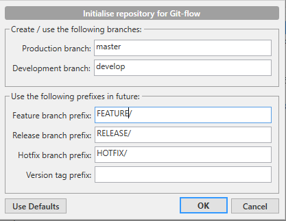

### Utilizando línea de comandos

También se puede ejecutar el comando `git flow init` y proporcionar la misma información.

### Añadir cambios para la siguiente versión (feature)

1. Crear una rama FEATURE/UVE-{código jira}-{descripción opcional} desde develop.

   - Utilizando Source Tree:

     1. Desde la rama develop, pulsar el botón Git-flow y seleccionar Start New Feature

        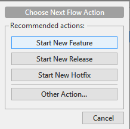

     2. Rellenar el nombre de la rama:

        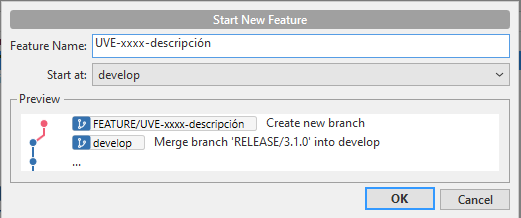

   - Utilizando línea de comandos:
     1. Ejecutar `git flow feature start uve-xxxx-description`
   - Utilizando bitbucket:
     1. Acceder al [formulario para crear rama en bitbucket](https://bitbucket.org/_uve_/uvecore/branch)
     2. Seleccionar el tipo Feature y rellenar el campo con el nombre de la rama

2. Subir la rama al repositorio remoto.
3. Ir subiendo cambios a esa rama. Hacer merge desde develop a esta rama al menos una vez al día.
4. Una vez finalizada, abrir pull request desde la rama feature hacia develop.
5. Una vez cumplidos los mínimos para cerrar la pull request, cerrarla desde el propio bitbucket marcando siempre el check de la parte inferior para que borre la rama original

   

### Generar una nueva versión de la aplicación (release)

1. Determinar el nombre de la nueva versión: {major}.{minor}
   1. En origin/master debe haber un tag indicando cuál es la última versión de la aplicación.
   2. Tomaremos esa versión como referencia para los valores major y minor.
      - Incrementaremos major cuando haya cambios incompatibles con versiones anteriores (y minor será 0)
      - Incrementaremos minor en caso contrario.
      - Para una nueva versión, la última parte (patch) será siempre 0.
2. Crear una rama RELEASE/{major}.{minor}.0 desde develop y marcar un tag {major}.{minor}.0-rel1

   - Utilizando Source Tree:

     1. Desde la rama develop, pulsar el botón Git-flow y seleccionar Start New Release

        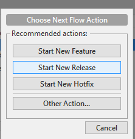

     2. Rellenar el nombre de la rama:

        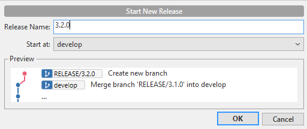

     3. Marcar con un tag el primer commit de la release:

        1. Botón derecho en el commit donde está la rama release
        2. Seleccionar Tag
        3. Indicar el nombre, marcar la opción push tag para que lo suba al repositorio remoto

           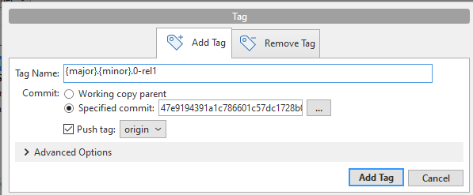

     4. Subir la rama al repositorio remoto.

   - Utilizando línea de comandos:
     1. Lanzar el siguiente comando powershell desde la raíz del repositorio
        ```
        .\cicd\create-release.ps1 {major}.{minor}
        ```
     2. Subir la rama y el tag al repositorio remoto.

3. Validar la release
4. Cerrar la release

   - Utilizando Source Tree:

     1. Desde la rama release, pulsar el botón Git-flow y seleccionar Finish Release

        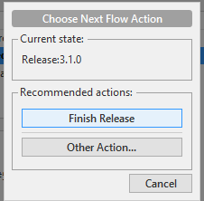

     2. En el siguiente formulario, asegurarse de que los siguientes checks están marcados

        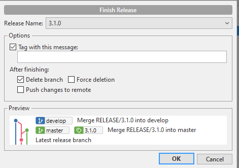

     3. Subir los cambios en las ramas develop y master, y el tag creado sobre master, a remoto (si no se marcó la opción Push changes to remote).

### Corregir errores en una versión en validación (bugfix)

1. Crear una rama BUGFIX/UVE-{código jira}-{descripción opcional} desde la rama release.
2. Subir la rama al repositorio remoto.
3. Ir subiendo cambios a esa rama. Hacer merge desde release a esta rama al menos una vez al día.
4. Una vez finalizada, abrir pull request desde la rama feature hacia develop.
5. Una vez cumplidos los mínimos para cerrar la pull request, cerrarla desde el propio bitbucket marcando siempre el check de la parte inferior para que borre la rama original
   
6. Hacer merge desde la rama release a la rama develop.

### Generar un parche en producción (hotfix)

1. Determinar el nombre de la nueva versión: {major}.{minor}.{patch}
   1. En origin/master debe haber un tag indicando cuál es la última versión de la aplicación.
   2. Usaremos los mismos valores para major y minor, incrementaremos patch en 1
2. Crear una rama HOTFIX/{major}.{minor}.{patch} desde master

   - Utilizando Source Tree:

     1. Desde la rama master, pulsar el botón Git-flow y seleccionar Start New Hotfix

        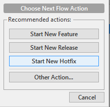

     2. Rellenar el nombre de la rama:

        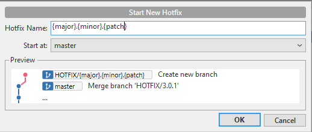

     3. Subir la rama al repositorio remoto.

   - Utilizando línea de comandos:
     1. Ejecutar el comando git `git flow hotfix start {major}.{minor}.{patch}`
     2. Subir la rama y al repositorio remoto.

3. Añadir los cambios necesarios.
4. Abrir PR desde la rama hotfix hacia master poniendo como revisores, como mínimo Oriol Ventosa y Pau Pala. En su defecto poner Marc Otal. Usaremos la PR sólo como herramienta de code review, **esta PR no se debe cerrar desde bitbucket** (ya que cerrar un hotfix implica mucho más que un merge).
5. Cerrar el hotfix

   - Utilizando Source Tree:

     1. Desde la rama hotfix, pulsar el botón Git-flow y seleccionar Finish Hotfix

        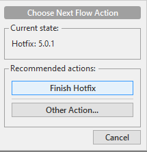

     2. En el siguiente formulario, asegurarse de que los siguientes checks están marcados

        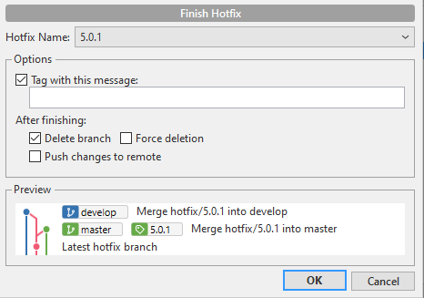

     3. Hacer merge desde master a release
     4. Hacer merge desde release a develop
     5. Subir los cambios en las ramas develop, release y master, y el tag creado sobre master, a remoto.

6. Esperamos que finalice la Build de UveCore y los Tests automáticos en la [pipeline build.core](https://dev.azure.com/uvesolutions/UveCore/_build?definitionId=50) (la duración aproximada son unos 30 minutos aproximadamente si todo está bien, no hacer deploy en prod hasta el punto 13).
7. Subir la nueva Build al entorno de Preprod desde la pipeline [deploy.connecta](https://dev.azure.com/uvesolutions/UveCore/_build?definitionId=53) o [deploy.datamart](https://dev.azure.com/uvesolutions/UveCore/_build?definitionId=54).
8. Ejecutar el [Comparador de versiones](https://dev.azure.com/uvesolutions/UveCore/_build?definitionId=55) seleccionando la nueva Build de la rama “master” contra el anterior Build correcto (la duración aproximada es de unas 3 horas)._NOTA:En algunos HotFix, puede ser que no podamos esperar a la finalización del comparador para continuar con la subida. Pero igualmente lo lanzamos!!_
9. Mientras se ejecuta el Comparador de versiones, avisar al equipo de Suport para que proceda con la validación de los cambios en el entorno de Preprod (intentamos dar como mínimo 20 minutos,lo ideal seía 2 horas).
10. Mientras ellos validan los cambios, realizamos petición a Jordi Camps para proceder con la subida al entorno de Productivo.
    _NOTA:En el caso de que Jordi Camps no nos la pueda validar, podemos recurrir por este orden, a Joan Manel, Santi Vila, Raquel Cobo o Jordi Vila._
11. Rellenamos el Excel con los datos del Hotfix en el documento [Historial Releases Producto.xlsx](https://uvesolutionsoutlook.sharepoint.com/:x:/r/sites/ProductDevelopment/_layouts/15/Doc.aspx?sourcedoc=%7B5CB5D358-45EF-42BA-BA68-B5FCF46E498C%7D&file=Historial%20Releases%20Producto.xlsx&wdLOR=c0753FE0B-EA6A-4452-A9DD-AC010FFB1D77&action=default&mobileredirect=true)
12. Cuando tengamos la confirmación de subida de Jordi Camps, enviamos email informando del Hotfix (según plantilla estándar) a los equipos de Operations, Support y Connecta.
13. Validamos en el entorno de PreProductivo
14. Esperamos y comprobamos el resultado del Comparador de versiones. Si la urgencia del HotFix no permite esperar, nos saltamos este paso y deberemos validar el comparador de versiones a posteriori.
15. Subimos la nueva Build a Productivo desde la pipeline [deploy.connecta](https://dev.azure.com/uvesolutions/UveCore/_build?definitionId=53) o [deploy.datamart](https://dev.azure.com/uvesolutions/UveCore/_build?definitionId=54) siguiendo los pasos de la sección "Subida versión Connecta, DataMart y UveAgents" del [Manual de subida de versión a Prod](https://uvesolutionsoutlook.sharepoint.com/:w:/r/sites/UVE/Documentos%20compartidos/UVE%20Library/INTERNAL%20USE/RESOURCES%20%26%20TOOLS/PRODUCT%20MANUALS/Connecta/CORE/MANUAL%20SUBIDA%20VERSI%C3%93N%20A%20PROD.docx?d=wec3fe72376a247208279f8752928711e&csf=1&web=1&e=PdMAP6)
16. Notificamos a los equipos de Operations, Projects Support, Product Support y Connecta, la finalización del Hotfix.

## Protocolo de reversión de cambios ya integrados en release

En caso de que un cambio se haya integrado en release o master, y necesitemos deshacerlo,
deberemos seguir estos pasos:

1- Determinar si los cambios a revertir se encuentran ya en **master** o sólo en **release**.

2- Revertir los cambios en la rama pertinente:

- Si la tarea se encuentran en **master**, crear un hotfix siguiendo lo indicado en el apartado anterior.
- Si la tarea se encuentran en **release**, crear un bugfix siguiendo lo indicado en el apartado anterior.

> Nos podemos ayudar del comando `git revert <commit hash>` para deshacer los cambios
> automaticamente de los commits que queramos revertir.

> **IMPORTANTE:** Se debe hacer revert en orden de los commits, del más nuevo al más antiguo.

3- (Opcional) Si necesitamos que los cambios vuelvan a subir a la siguiente versión, deberemos "deshacer lo deshecho"
para restaurar la tarea en las ramas pertinentes.

- Si lo queremos restaurar para la release actual:

  - Crear una rama bugfix en **release** siguiendo lo indicado en el apartado anterior.
  - Hacer `git revert <commit hash>` en la rama **bugfix** de los **commits que revertieron los cambios** en el primer paso.
    - > **IMPORTANTE:** Se debe hacer revert en orden de los commits, del más nuevo al más antiguo.

- Si lo queremos restaurar a develop para que vaya a la siguiente release:
  - Crear una rama feature en **develop** siguiendo lo indicado en el apartado anterior.
  - Hacer `git revert <commit hash>` en la rama **feature** de los **commits que revertieron los cambios** en el primer paso.
    - > **IMPORTANTE:** Se debe hacer revert en orden de los commits, del más nuevo al más antiguo.

## Proyectos

### UveDoorman:

Es un servicio que trata los archivos del **preinbox** y los mueve a la carpeta inbox.

Todos los archivos de la carpeta preinbox se depuran con la solución uveDoorman.

Podemos encontrar dos tipos de archivos, uno es el nomenclátor estándar de UVE, para conocer los nomencladores estándar hay que ir a la clase Nomenclator.cs

O también podemos encontrar archivos que necesitan un tratamiento diferente y estos tienen que pasar por un Convertidor Universal, de aquí en adelante CU, este CU se configura a nivel de distribuidor.

#### ¿Cómo se debuga uveDoorman?

Debe abrir el repositorio UveCore que está en el bitbucket o que ya está en su máquina. Vaya a Explorador de soluciones, uveDoorman y Establecer como proyecto de inicio, vaya a propiedades, y en la pestaña debug en argumentos ponga el archivo .ini que hará referencia al entorno que se quiere hacer el debug.

-inifile=C:\Users\MarcOtal_UveProjects\uvecore\uveDoorman\bin\Debug\connecta.ini  
 -sipagent=5007
-sipstatus=AA

Si es la primera vez que se hace, no se encontrará la siguiente carpeta ya que nunca se ha realizado una depuración, entonces lo que tendrá que hacer es compilar la solución en modo debug. Una vez que haya creado la carpeta, copie el archivo connecta.ini


Para poder debugar un agente en concreto, hay que indicarlo con el parámetro _-sipagent tambíen indicando el estado de la tarea _-sipstatus
De esta manera, si actualizamos el **MSG_STATUS** de una tarea, podremos debugarla correctamente

```
UPDATE TAREAS SET MSG_STATUS = 'AA' WHERE MSG_ID = 'xxx' AND IdcAgente = xxx
```

En Log2.CS modifique la variable modeDebug= false a true para que los errores aparezcan en AlertLog.

A partir de ahí, compile la solución y arranque en modo de depuración.

Es decir, si tenemos que debugar un fichero que tiene conversol universal, segementada,simplificada, se deberá hacer con el UveDoorman.

### UveIntegrator:

Como su nombre dice, sirve para integrar archivos del **inbox** en la base de datos. Todos los archivos que queramos integrar tendrán una nomenclatura estándar y los archivos están dentro de la solución ConnectaLib. Con este servicio sólo se integran SipIn's.

**UveIntegratorParallel** es el mismo proyecto **UveIntegrator** pero se se instala con otra configuración (Connecta.ini) para que este proceso realice las tareas de SipUpd, SipOut y sipDel. Para depurarlo se hace igual que en UveIntegrator.

Cuando los archivos están en la inbox, el procedimiento de depuración será distinto.

Tendrás que depurar el sipIn, SipOut, sipUpd, SipDel que sea necesario, para ello se marcará como Establecer proyecto de inicio el proyecto UVEINTEGRATOR.

Recuerde que el archivo predeterminado se toma de: C:\Users\nombre_usuario_UveProjects\uvecore\uveIntegrator\bin\Debug\connecta.ini (esta ruta depende de donde se haya clonado el repositorio)

Iremos a las propiedades de uveintegrator y pondremos los siguientes parámetros en la pestaña debug: (Para tener en cuenta, los parámetros no pueden tener saltos de línea, tiene que estar separados por espacios).

#### !Atención!:

TODOS ESTOS PARÁMETROS ESTÁN EN LA TABLA TAREAS de la Base de datos.

Aquí tenemos diferentes ejemplos como pasar los parámetros:

##### SipIn:

-siptype=sipInProductosDistribuidor -sipagent=506

##### SipUpd:

-siptype=sipUpdProcesarIssuesAgente -sipagent=13000 -sipDataSource=ClientesUniverso -sipcodes='33586127'

##### SipOut:

-siptype=sipOutPersonalizadoParaAgente -sipagent=49 -sipfileformat=TXT -sipfilename=Clientes_CAPSA.txt -sipsqlid=CAPSA_CLIENTES -sipfieldseparator=|#|

Aparte de todos los archivos estándar que recibimos e integramos también tenemos un proceso llamado SipInMovilizer y SipOutMovilizer, también funciona con el servicio UveIntegrator.

### SipInMovilizer – SipOutMovilizer (STREET):

Cuando hablamos de Street, es un servicio que tenemos que sincronizar con una aplicación llamada Movilizer que nos convierte en un interlocutor entre nuestro BD y el programa que los usuarios tienen en la tablet.

Para depurar STREET, tendremos que saber si se trata de un archivo de entrada a nuestro sistema o de salida a Movilizer. Si se trata de un archivo de entrada tendremos que hacer la depuración del sipInMovilizer y el agente correspondiente, poniendo el archivo .blk que nos dejan en el JIRA, en la carpeta inbox de nuestra máquina.

Parámetros debugar:

-siptype=SipInMovilizer -sipagent=183

Los archivos deben comenzar de la siguiente manera: MovilizerResponseDataContainer*ALL*_.blk -> ON_ es cualquier otro valor.

Y siempre hay que modificar las dos primeras líneas del archivo .blk que nos dejan en el JIRA para estas dos:

```
<?xml version="1.0" encoding="utf-8"?>

<MovilizerUploadDataContainer xmlns:xsi="http://www.w3.org/2001/XMLSchema-instance" xmlns:xsd="http://www.w3.org/2001/XMLSchema" source="CLIENT">
```


y agregue esto: xmlns="http://movilitas.com/movilizer/v16"> al final de la tercera


Si es un archivo de salida deberemos ejectutar el sipOutMovilizer, modificando los argumentos de depuración.

Los argumentos principales son estos:

-siptype=sipOutMovilizer -sipagent=183

Si queremos buscar solo un gestor tenemos que añadir: -sipgestor=MPN_0021

#### !Atención!:

Los ficheros sipOut genera un fichero y cuando haces el debug apuntando a preproducción se sube en demo.movilizer.com

### Datamart:

Para hacer el debug de datamart, se tendra que ir al proyecto Datamart y abrir el fichero CargaDatamart.cs y CargaDatamart.ini.

En el fichero ini se deberá fijar el servidor y la BD donde queremos atacar, y en el clase CargaDatamart se deberá comentar dicha linea:


Y descomentar la siguiente. A partir de allí, según el tipo de “incidencia” que tengamos ya sea, facturación, normalizacion, matching, visibilidad, Alertas,.. Modificaremos la funcion BuildXXX por la que nos toque.

A partir de allí, pondremos los siguientes BreakPoints en las lineas:

La linea 204 nos la saltaremos cuando estemos debugando.


### Otros PROCESOS internos de UVE:

#### Vigilancia-UveWatchdog:

Estos servicios se utilizan para depurar la vigilancia que tenemos en UVE. Hay que tenerlo en cuenta ya que en las vigilancias se envían correos electrónicos a usuarios o clientes de UVE y por ello, hay que tener mucho cuidado a la hora de querer hacer una depuración de los mismos.

Tablas implicadas en las vigilancias:

Select \* from cfgVigilancias;

Select \* from cfgVigilanciasDestinatarios;

Select \* from cfgVigilanciasProgramación;

Estas configuraciones se utilizan para hacer el debug:

-idvigilancia=802 -nombregrupo=ConnectaRecordatorios

### UveDatabaseMaintainer

(pendiente documentar)

## Desinstalación / Instalación de servicios

Para desinstalar / instalar nuevos servicios, seguiremos los siguientes pasos.

Opcionalmente, podemos obtener el listado de todos los servicios de uve en un fichero txt, mediante el siguiente comando en power shell.

```sh
Get-Service -Displayname "*uve*" | select -property name,starttype | Out-File -filepath "$Env:userprofile\Desktop\ServicesList.txt"
```

A continuación crearemos un fichero .bat con los servicios a desinstalar / instalar

```sh
@ECHO OFF

REM The following directory is for .NET 4.0
set DOTNETFX2=%SystemRoot%\Microsoft.NET\Framework\v4.0.30319
set PATH=%PATH%;%DOTNETFX2%

cd "C:\UVESolutions\Connecta"

InstallUtil /u uveIntegratorWindowsService.exe /ServiceName="uveIntegrator Service"
InstallUtil /i uveIntegratorWindowsService.exe /inifile="C:\UVESolutions\Connecta\ini_multi\Connecta_25.ini" /ServiceName="uveIntegrator Service" /ServiceStartMode=Automatic /username="uvedom\uve_connectaUser" /password=xxx
```

- /u desinstalar
- /i instalar

En el ejemplo anterior desinstalamos el servicio **uveIntegrator Service** para instalarlo posteriormente indicándole una nueva ruta para el fichero de configuración

Una vez creado el fichero **.bat** lo ejecutaremos con permisos de administrador.

Recordar actualizar la password por la correspondiente del usuari uvedom\uve_connectaUser
