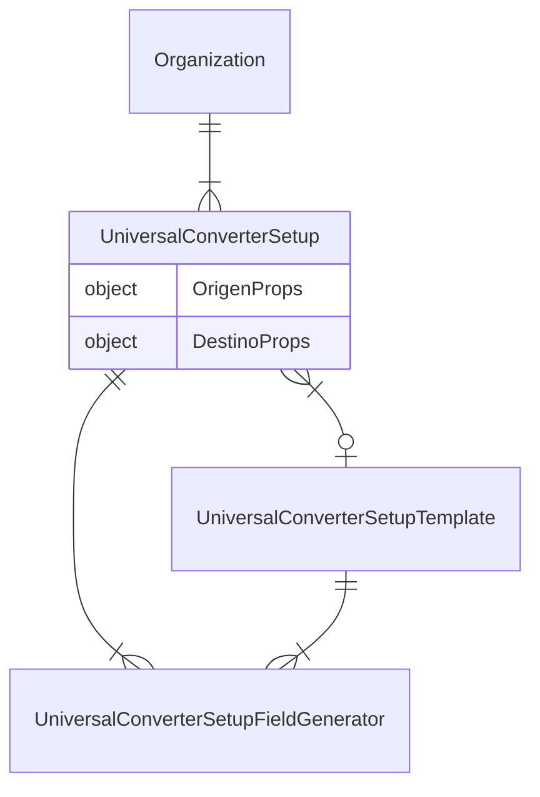
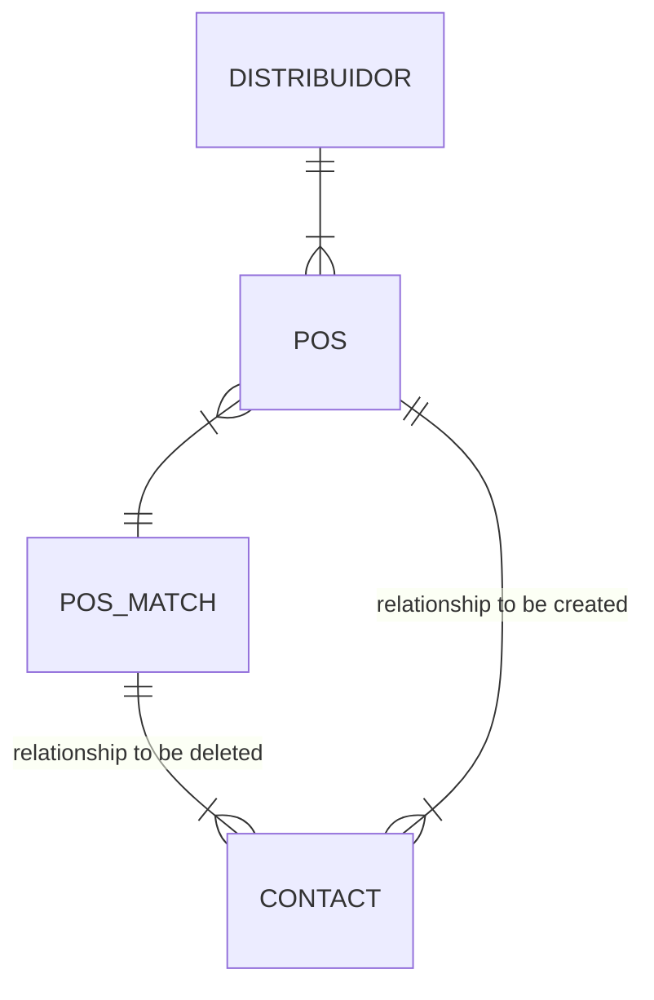

# Connecta Data models

Partial datamodel for connecta

## Universal Converter Entities

```mermaid
erDiagram

    Organization ||--|{ UniversalConverterSetup : ""
    UniversalConverterSetup }|--o| UniversalConverterSetupTemplate : ""
    UniversalConverterSetup ||--|{ UniversalConverterSetupFieldGenerator :  ""
    UniversalConverterSetupTemplate ||--|{ UniversalConverterSetupFieldGenerator : ""

    UniversalConverterSetup {
        object OrigenProps
        object DestinoProps
    }

```

## POS <> Contacts

```mermaid

erDiagram
    DISTRIBUIDOR ||--|{ POS : ""
    POS }|--|| POS_MATCH : ""
    POS_MATCH ||--|{ CONTACT : "relationship to be deleted"
    POS ||--|{ CONTACT : "relationship to be created"
```
