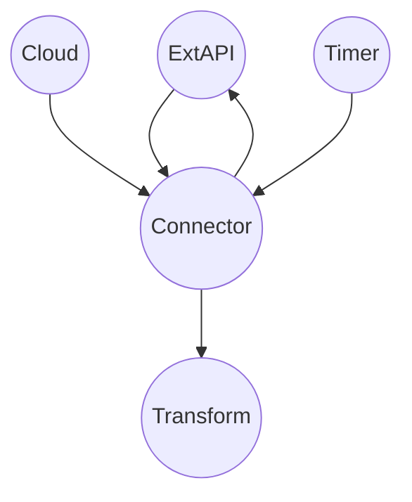
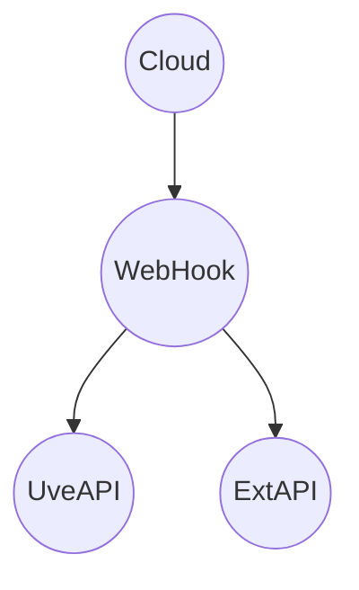

- Accéss a repos
- Analitzem casos reals i estructures tipus de projecte

## Analisis Tipus:

### Conversor:

```mermaid
flowchart TD
```

- Treballa files amb preinbox.
- Agafa segons mascara.
- Interacciona amb la outbox

**Idees**

- Faltaria llibreria de gestió arxius, bk, snaps, blobs, fluxes.

### Programa específic

```mermaid
flowchart TD
```

- Entrada out/api/DB
- Trigger bia bat

### Connector



### WebHook

- No DB
- No FS
- Reactive
- AzureFN



## Conclusions

- Els punts de contacte amb ConnectaSDK son pocs.
- Detectats 4 tipus base de projecte (2 locals/2 AzFN)
- Possibilitat de substiuir projectes a AzFN de les plantilles a fluxe modular amb contractes (una instància, multiples dll)
- Possibilitat d'extreure els projectes locals a AzFn: Caldria abstreure la gestió de fitxers i l'accés a DB.

## TODO

- Traslladar esquemes fotos
- Plantejar arquitectura modular (Connectors/WebHooks Sergio)
- Valoració funcionalitats AzFN vs AKS?
- Valorar AzFN com a solució definitiva (validar amb infra, preus, escalat, tunnels DB, blobs)
- Plantejar solucions per moure tot a AzFN (Solucions per accés a DB i abstració de fitxers)

- Fer informe de conclusions JC
  - Què volem per Connecta SDK (Poca sinèrgia amb Connecta SDK)
  - Possiblitat de migrar Custom a pocs projectes escalables i modulars
  - Possiblitat de migrar tot a AzFN (o AKS?)
