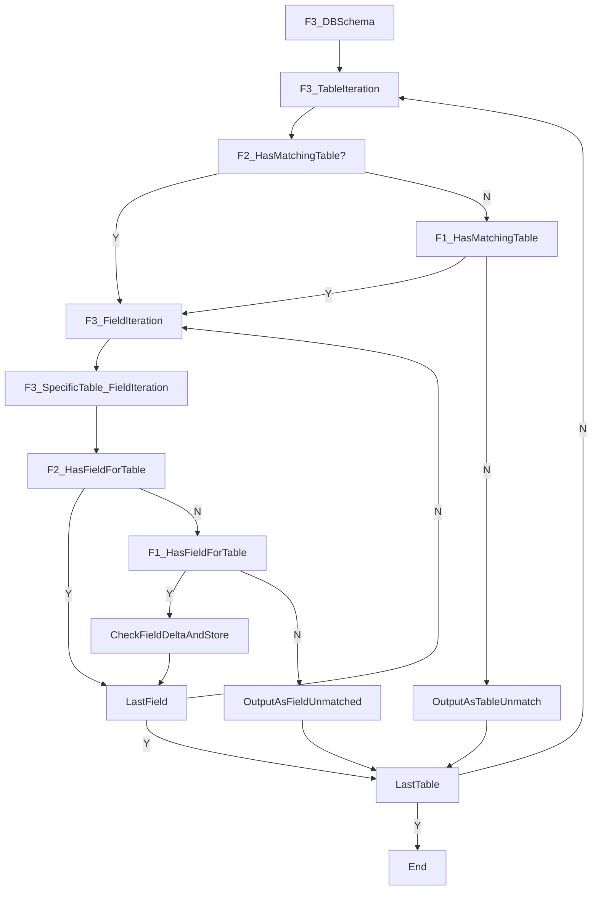

# Match records to DB

- F1 = Records (JSON)
- F2 = Patch (JSON)
- F3 = DB Schema
- F4 = Updates to F1

```mermaid

flowchart TD

    F3_DBSchema --> F3_TableIteration --> F2_HasMatchingTable?

    F2_HasMatchingTable? --Y--> F3_FieldIteration
    F2_HasMatchingTable? --N--> F1_HasMatchingTable

    F1_HasMatchingTable --Y--> F3_FieldIteration
    F1_HasMatchingTable --N--> OutputAsTableUnmatch --> LastTable


    F3_FieldIteration --> F3_SpecificTable_FieldIteration --> F2_HasFieldForTable

    F2_HasFieldForTable --Y--> LastField
    F2_HasFieldForTable --N--> F1_HasFieldForTable

    F1_HasFieldForTable --Y--> CheckFieldDeltaAndStore  --> LastField
    F1_HasFieldForTable --N--> OutputAsFieldUnmatched --> LastTable

    LastField --N--> F3_FieldIteration
    LastField --Y--> LastTable


    LastTable --N--> F3_TableIteration
    LastTable --Y--> End


```
